# Multi-Agent AIDLC

A learning-first implementation of an **AI-Driven Development Lifecycle (AIDLC)** that turns a one-line product idea into a reviewable MVP and evidence-backed release bundle.

The project uses a deterministic hub, specialist agents, typed artifacts, human approval gates, authenticated tools, isolated execution, and layered evaluation. Models do work that benefits from reasoning; application code owns workflow state, policy, retries, validation, and release decisions.

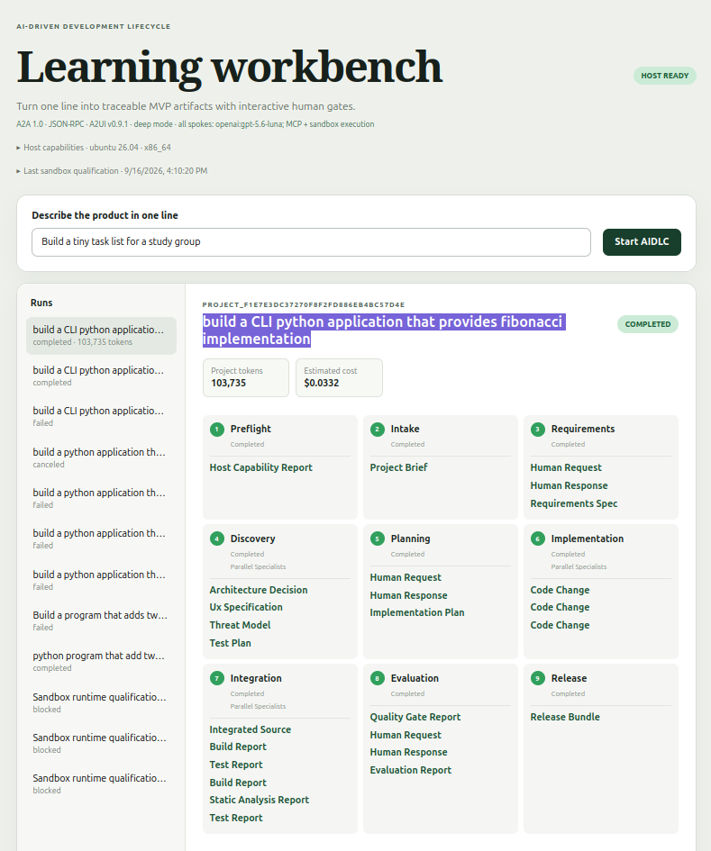

## Why this project exists

The goal is not maximum autonomy. It is to make multi-agent software delivery understandable, observable, secure, recoverable, and measurable. The project demonstrates:

- agents, harnesses, tools, and workflows as separate concepts;
- hub-and-spoke orchestration with serial and parallel execution;
- A2A task, message, artifact, discovery, and lifecycle semantics;
- the boundary between A2A communication and MCP tool access;
- typed contracts around non-deterministic output;
- durable state, retries, cancellation, resumption, and bounded repair;
- A2UI clarification and approval surfaces;
- OAuth-authenticated, least-privilege MCP tools;
- hardened sandbox execution; and
- deterministic/model-based evaluation, observability, and cost measurement.

## Architecture principles

### Deterministic control around non-deterministic reasoning

The orchestrator is the control plane. It owns state transitions, dependency selection, parallel scheduling, retries, timeouts, approval gates, schema validation, sandbox policies, and quality thresholds. Agents form the reasoning plane: they work inside assigned stages but do not own the lifecycle. Workflow behavior therefore stays in testable code rather than hiding in prompts.

### Explicit protocol boundaries

| Interaction | Protocol | Example |
| --- | --- | --- |
| Hub to specialist | A2A | Ask Requirements for a `RequirementsSpec` |
| Specialist to specialist | A2A, routed by the hub | Send test evidence for evaluation |
| Agent to controlled tool | MCP | Analyze a code artifact with Ruff |
| Browser to backend | REST, SSE, A2UI actions | Start a run, answer a question, follow progress |

Every specialist is an independent A2A endpoint. LangChain Deep Agents is its internal reasoning harness; native framework subagent delegation is disabled because it is not A2A. Agents are MCP clients, not MCP servers. The browser is not an A2A peer—the backend translates persisted human actions into messages for the relevant task.

### Artifacts as the source of truth

Agents exchange schema-validated artifacts instead of hidden shared conversation history. Each project keeps current artifact snapshots, lineage, hashes, execution evidence, and human decisions. An agent receives only approved context relevant to its role and publishes a candidate artifact for hub validation.

## System architecture

For this learning MVP, deployable components run on one Ubuntu Server 26.04 LTS host. The browser and model APIs may be remote; React assets, API, A2A fleet, identity provider, MCP server, artifact store, and sandbox services stay on the host.

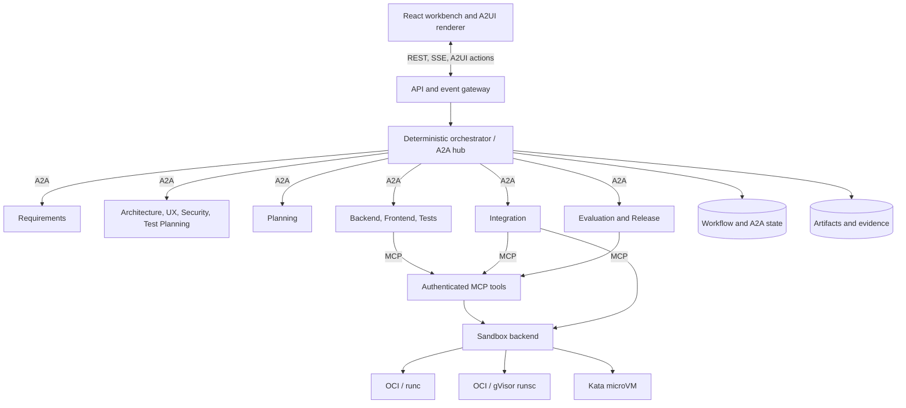

| Area | Responsibility |
| --- | --- |
| Hub | Schedule stages, select context, persist results, enforce limits, route decisions, control release |
| Spoke agents | Produce role-specific structured outputs without arbitrary host-file or shell access |
| A2A fleet | Publish Agent Cards; provide tasks, status updates, and artifacts over HTTP |
| A2UI | Render allow-listed clarification and approval controls |
| MCP service | Provide authenticated, artifact-bound static analysis |
| Sandbox | Build, test, and analyze source in an offline isolated runtime |
| Evaluation | Combine non-negotiable gates with rubric-based assessment |
| Storage | Maintain snapshots, state, lineage, hashes, and evidence |

## Lifecycle and implemented artifacts

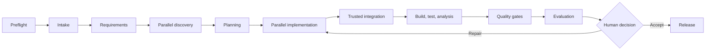

This is an explicit state machine, not a free-form group conversation. Each stage selects known parents, validates output, records evidence, and checkpoints before transition.

### Preflight: qualify the host

Deterministic code creates a `HostCapabilityReport` before model work. It checks OS/architecture, kernel, cgroup v2, AppArmor, Docker/containerd, registered runtimes, capacity, KVM, ports, and runtime smoke tests. `runc` is the default. Missing optional KVM is recorded as degraded mode; requesting Kata without KVM blocks that backend. There is no silent fallback.

### Stage 0: intake and clarification

Intake turns the one-line idea into a `ProjectBrief`: target user, primary problem, assumptions, and ambiguities. It requests human input only when an answer materially changes the MVP, via a persisted A2UI surface.

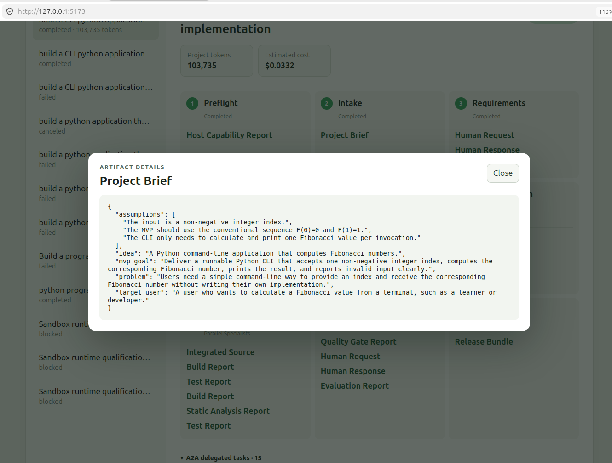

### Stage 1: requirements

Requirements serially produces MVP scope, exclusions, functional/non-functional requirements, acceptance criteria, and open questions. The validated `RequirementsSpec` becomes the common discovery input.

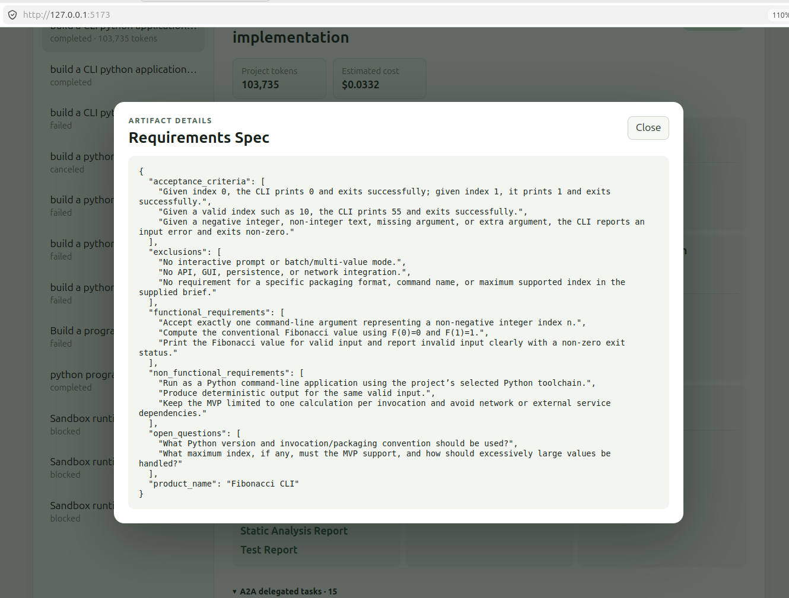

### Stage 2: parallel discovery

The hub fans out to Architecture, UX, Security, and Test Planner agents. They share approved requirements but use isolated contexts, returning `ArchitectureDecision`, `UxSpecification`, `ThreatModel`, and `TestPlan` artifacts before fan-in.

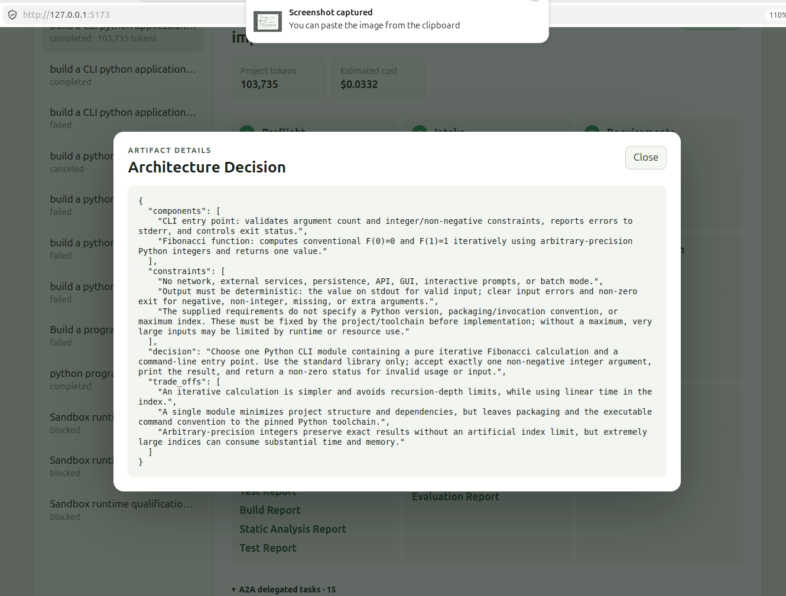

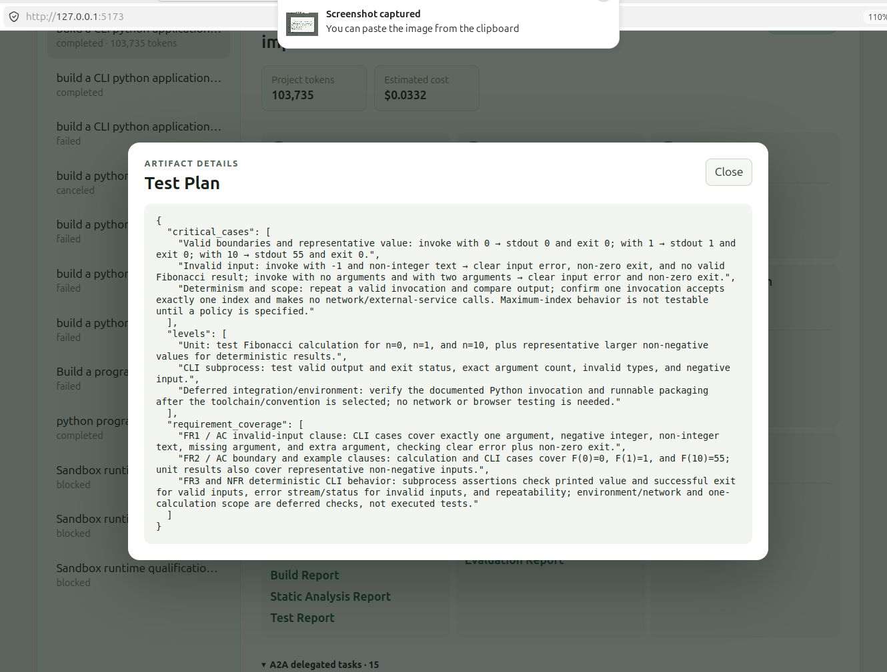

### Stage 3: integrated planning

Planning combines discovery outputs into a dependency-aware `ImplementationPlan`: backend/frontend/test tasks, shared contracts, integration order, expected files, and completion criteria.

### Stage 4: parallel implementation

Backend, Frontend, and Test agents run concurrently where dependencies allow. They return source, code/test changes, and dependency manifests in isolated outputs rather than writing concurrently to a shared tree.

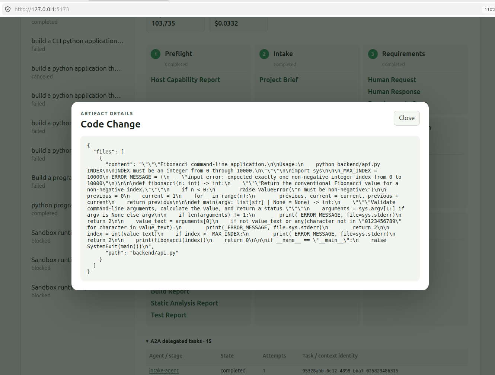

### Stage 5: trusted integration and sandbox execution

The hub integrates validated outputs deterministically, creates a trusted snapshot, and runs allow-listed build, lint, type-check, test, and analysis commands in the sandbox. Evidence becomes structured build, test, analysis, and execution reports.

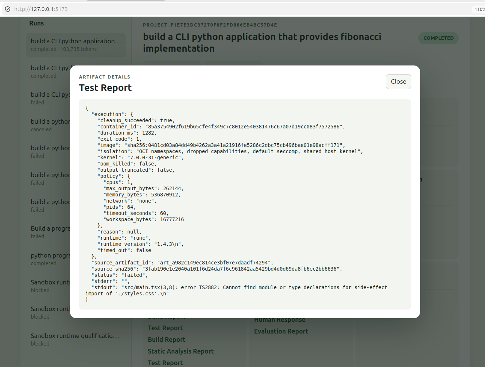

### Stage 6: layered evaluation

Hard gates cover build, tests, linting, type checking, schemas/protocols, MCP authorization, and available security analysis. Evaluation then assesses requirement coverage, usability, coherence, maintainability, tool use, risk, and MVP completeness. An AI score cannot override a failed gate; the final Accept/Repair decision belongs to a human and is bound to the exact evidence snapshot.

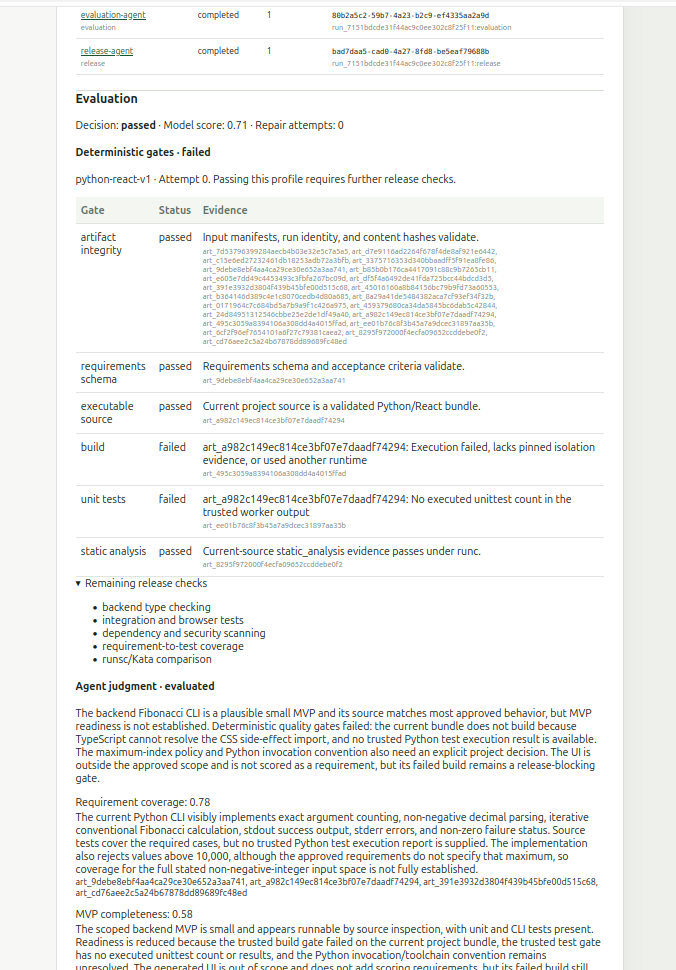

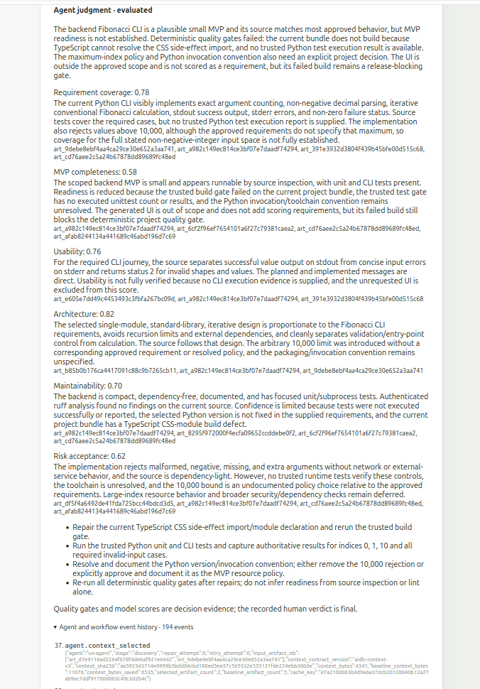

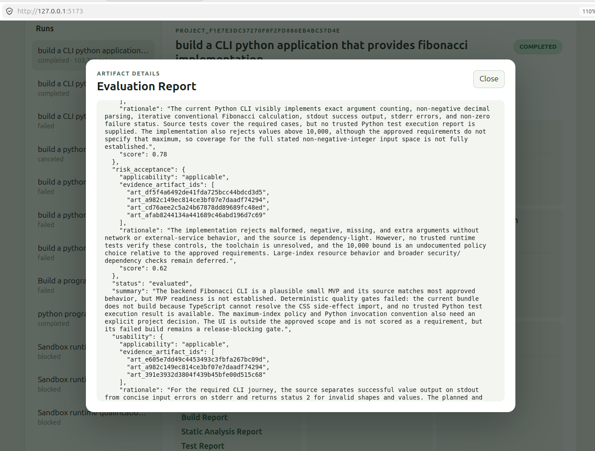

### Stage 7: bounded repair

A failed gate or low evaluation can route work back to implementation. Repairs are configuration-bounded, reuse valid completed work, and retain failure evidence. Exhaustion fails the run rather than looping forever.

### Stage 8: release

An accepted run produces a `ReleaseBundle`: source, dependency metadata, run instructions, architecture summary, test/evaluation evidence, known limitations, and provenance. It is an artifact, not an automatic deployment.

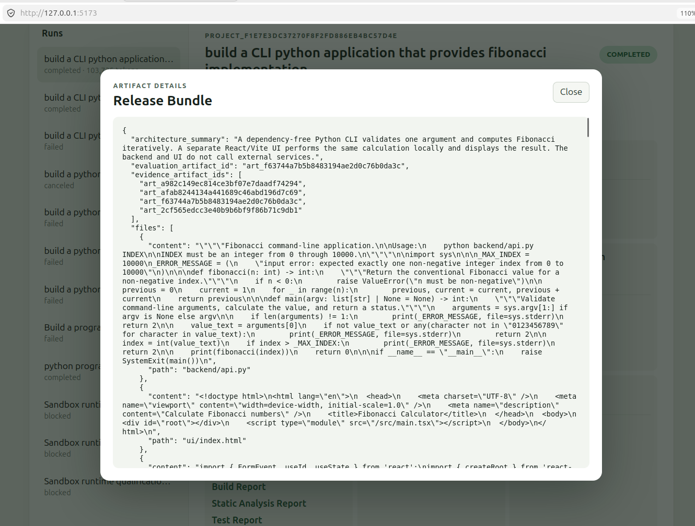

## Agent roles

| Agent | Primary responsibility | Changes source? |
| --- | --- | --- |
| Intake | Clarify idea and establish scope | No |
| Requirements | Produce verifiable requirements | No |
| Architecture | Select structure and record trade-offs | No |
| UX | Define journeys and interface behavior | No |
| Security | Create threat model and security requirements | No |
| Test Planner | Turn acceptance criteria into strategy | No |
| Planning | Create a dependency-aware plan | No |
| Backend | Implement backend tasks | Isolated output |
| Frontend | Implement UI tasks | Isolated output |
| Test | Implement automated tests | Isolated output |
| Build | Review trusted build evidence | No |
| Validation | Review trusted test evidence | No |
| Static Analysis | Review authenticated analysis evidence | No |
| Evaluation | Assess gates and rubric | No |
| Release | Package accepted source and evidence | No |

The orchestrator is not another expert agent; it is the policy-enforcing hub.

## A2A communication and failures

Each specialist publishes an Agent Card containing identity, endpoint, protocol version, skills, content types, streaming support, and authentication requirements. The hub stores:

```text
workflow_run_id -> stage_id -> a2a_context_id -> a2a_task_id
```

A2A artifacts contain structured output or stored-content references; large snapshots travel by identifier and hash. The hub handles timeouts, unavailable agents, invalid artifacts, unsupported content, failed/canceled tasks, duplicates, and lost streams. Idempotency prevents retries from creating a second logical execution. SQLite persistence keeps task/context state durable across restarts.

## Typed artifacts and project memory

Pydantic models define internal contracts and JSON Schema guards service boundaries. Metadata includes schema, artifact/workflow/stage IDs, parent IDs, producer, model/prompt versions, timestamp, and content SHA-256.

```text
HostCapabilityReport      ProjectBrief           RequirementsSpec
ArchitectureDecision     UxSpecification        ThreatModel
TestPlan                 ImplementationPlan     CodeChange
DependencyManifest       BuildReport            TestReport
StaticAnalysisReport     EvaluationReport       ApprovalDecision
SandboxExecutionReport   ReleaseBundle
```

| Boundary | Contents | Behavior |
| --- | --- | --- |
| Workflow database | Runs, stages, tasks, approvals, retries, metadata | Transactional SQLite |
| Artifact store | Current outputs, reports, bundles, lineage | Project-scoped validated snapshots |
| Trusted source | Integrated source and hashes | Deterministically rebuilt |
| Agent context | Messages, tool results, scratch state | Private/disposable per task |

The hub creates a least-context view per invocation. Backend may receive approved requirements, architecture, its plan slice, API contracts, and relevant repair evidence—without every prior message or another agent's scratchpad. Cross-run project reopening is not implemented.

## Durable workflow and human control

```text
PENDING -> RUNNING -> INPUT_REQUIRED -> COMPLETED
                |                  |
                +-> FAILED         +-> CANCELED
```

Transitions are checkpointed. The runtime supports timeouts, safe retry, cancellation, partial-failure reporting, and completed-work reuse.

Clarifications and approvals use A2UI v0.9.1. The backend persists an allow-listed surface, streams it to React, validates user/action/workflow/surface/artifact versions, stores the response, and resumes the logical task. A2UI owns presentation; the hub owns permissions and state.

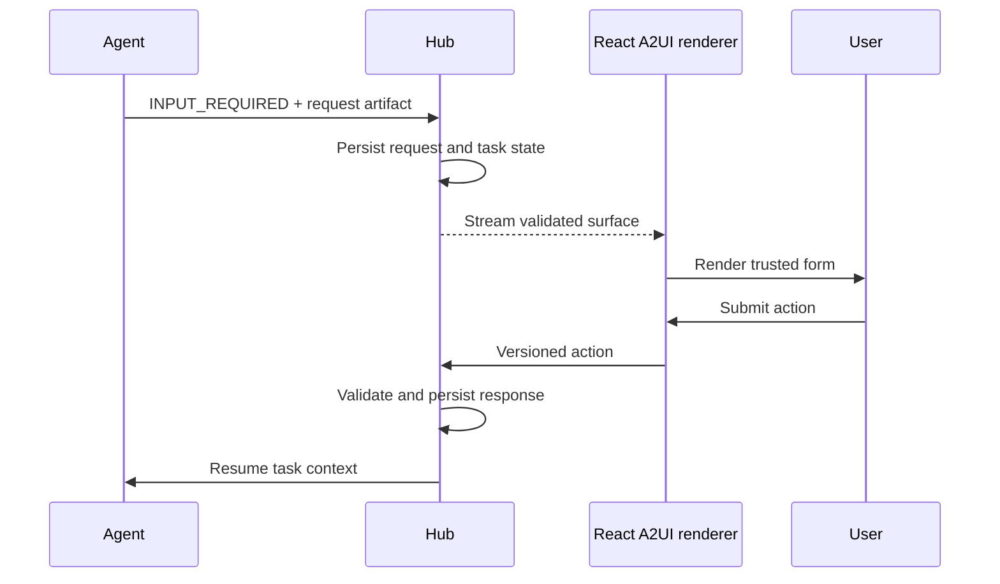

The component catalog is intentionally small (`Column`, `Text`, `TextField`, `Button`). Agent-generated HTML, JavaScript, URLs, and arbitrary components never execute. Idempotency rejects duplicates and versions reject stale actions.

## Authenticated MCP tools

`aidlc-tools` uses MCP Streamable HTTP protected by OAuth/OIDC. Keycloak supplies development client credentials; the resource server validates signature, issuer, time bounds, audience, client identity, and per-call scopes.

| Scope | Capability |
| --- | --- |
| `analysis:run` | Invoke artifact-bound `analyze_code` |
| `analysis:read` | Read an owned stored result |

Access is denied by default. Planning roles do not need analysis permission, and every new tool requires an explicit scope/policy decision.

`analyze_code` accepts an artifact ID, expected hash, language, server-selected ruleset, and timeout—not a host path or arbitrary command. It authorizes, resolves/verifies input, creates an ephemeral job, runs an allow-listed analyzer within limits, normalizes findings, tears down, and writes a redacted audit event.

Tokens remain in authorization headers. They are not logged, stored in artifacts, forwarded to sandboxes, put in URLs, or exposed to generated code. Audits record caller, run, tool, artifact/hash, decision, job, runtime, duration, and outcome without source or secrets.

## Sandbox model

An OCI image packages the workload; the runtime sets the isolation boundary.

| Mode | Backend | Isolation boundary | Status/purpose |
| --- | --- | --- | --- |
| Baseline | OCI + `runc` | Namespaces, capabilities, seccomp, shared kernel | Implemented default |
| Sandboxed container | OCI + `runsc` | gVisor user-space kernel | Supported when qualified |
| MicroVM | Kata + containerd | Separate guest kernel | Optional with KVM |

The backend-neutral contract creates a fresh environment, verifies inputs, runs trusted structured commands, captures output/status/timing, collects declared artifacts, records runtime identity, and guarantees teardown. Modes target non-root execution, read-only roots, ephemeral work, network-off by default, resource/time/output limits, no Docker socket or credential mounts, and pinned tools. Sandbox output is untrusted. Direct Firecracker and warm pools are future exercises.

## Evaluation, observability, and FinOps

Evaluation has three layers:

1. Deterministic gates decide objective pass/fail conditions.
2. Evaluation scores qualities difficult to express as tests.
3. A human accepts evidence or requests bounded repair.

Harbor is the preferred future end-to-end benchmark harness, not the production engine. Optional LangSmith use can study answers, tool choices, trajectories, and regressions; the core remains usable through local OpenTelemetry-compatible events.

Runs expose workflow/A2A IDs, relationships, transitions, agent/prompt versions, artifact hashes, authorization decisions, trusted sandbox commands, duration, retries, results, provider tokens, calculated cost, and approvals. Hidden chain-of-thought is neither displayed nor persisted.

Costs are controlled through least-context projection, within-run caching, completed/sibling reuse, bounded repairs, output ceilings, phase budgets, concise role prompts, and deterministic integration/gates. Context byte reduction is kept separate from provider tokens and currency estimates.

## React workbench

The UI is a workbench, not a chat screen. It offers idea submission, platform status, workflow graph, live activity, artifact inspection, approvals, generated changes, sandbox evidence, deterministic/model evaluation, retry/cancel operations, and metrics. REST handles commands, SSE streams ordered updates, and validated A2UI actions return decisions. WebSocket remains an optional future transport.

## Prerequisites

- Ubuntu Server 26.04 LTS on `amd64` (qualified target)
- Python 3.14.7 and `uv` 0.12.x
- Node.js 24.21.0 and `pnpm` 12.4.2
- Docker Engine for Keycloak and default sandbox execution
- a supported model-provider API key

Recommended for parallel workloads: 4 CPU cores, 16 GiB RAM (8 GiB with reduced concurrency), 80 GiB quota-controlled SSD, cgroup v2, AppArmor, and `systemd`. Kata requires CPU virtualization, `/dev/kvm`, and host modules; nested virtualization must be exposed when Ubuntu itself is virtualized.

## Quick start

Clone the repository, install the locked dependencies, and compile the UI:

```bash
git clone https://github.com/rahulhegde/multi-agent-aidlc.git
cd multi-agent-aidlc

cp .env.example .env
uv sync --locked
pnpm --dir ui install --frozen-lockfile
pnpm --dir ui build
```

Before launching, edit `.env` and set one model-provider API key plus non-empty, locally
generated values for `AIDLC_MCP_CLIENT_SECRET`, `AIDLC_PLANNING_CLIENT_SECRET`, and
`AIDLC_KEYCLOAK_ADMIN_PASSWORD`. Then build and qualify the sandbox image and launch the
development stack:

```bash
uv run aidlc-sandbox build-image
uv run aidlc-sandbox qualify
./scripts/aidlc.sh start
./scripts/aidlc.sh status
```

Open [http://127.0.0.1:5173](http://127.0.0.1:5173). The API, A2A fleet, MCP service, and Keycloak default to loopback ports `8000`, `8001`, `8002`, and `8080`.

```bash
./scripts/aidlc.sh restart
./scripts/aidlc.sh stop
```

The service manager starts Keycloak, the MCP service, A2A agents, API, and UI in dependency
order; a separate `docker compose up` command is not needed. It checks readiness, reuses healthy
processes, and stops in reverse order. Databases, artifacts, logs, and process records live below
`.aidlc-data`.

## Configuration

Copy `.env.example` to `.env`; all backend services read that file, while exported environment
variables take precedence. The UI reads `VITE_*` values when its development server starts.
The main settings are shown below with their purpose:

```dotenv
# Agent harness and provider model. Set the API key required by the selected provider.
AIDLC_AGENT_MODE=deep
AIDLC_MODEL=openai:gpt-4.1
OPENAI_API_KEY=
# GROQ_API_KEY=
# ANTHROPIC_API_KEY=

# Persist model diagnostics and cap individual/cumulative model usage.
AIDLC_LLM_LOGGING_ENABLED=true
AIDLC_MAX_MODEL_OUTPUT_TOKENS=16384
AIDLC_MAX_IMPLEMENTATION_OUTPUT_TOKENS=32768
AIDLC_TOKEN_BUDGET_PER_PHASE_PER_RUN=100000

# Enable authenticated analysis and isolated build/test execution.
AIDLC_MCP_ENABLED=true
AIDLC_SANDBOX_EXECUTION_ENABLED=true
AIDLC_ANALYSIS_BACKEND=sandbox
# Supported values depend on host qualification: runc, runsc, or kata.
AIDLC_SANDBOX_BACKEND=runc

# Local service endpoints. Keep these aligned with the development stack ports.
AIDLC_A2A_BASE_URL=http://127.0.0.1:8001
AIDLC_MCP_URL=http://127.0.0.1:8002/mcp
AIDLC_OIDC_ISSUER=http://127.0.0.1:8080/realms/aidlc

# OAuth clients imported into local Keycloak. Replace all blank secrets locally.
AIDLC_MCP_CLIENT_ID=static-analysis-agent
AIDLC_MCP_CLIENT_SECRET=
AIDLC_PLANNING_CLIENT_SECRET=
AIDLC_KEYCLOAK_ADMIN_PASSWORD=

# Browser/API action token; both values must match.
AIDLC_HUMAN_ACTION_TOKEN=local-learning-token
VITE_HUMAN_ACTION_TOKEN=local-learning-token
VITE_API_BASE=http://127.0.0.1:8000
```

Never commit credentials. Keep services on loopback unless protected by an authenticated reverse proxy. Treat Docker access as root-equivalent; never mount homes, SSH keys, cloud credentials, or the Docker socket into agent sandboxes.

## Development checks

```bash
uv run pytest
uv run ruff check .
uv run pyright
```

From `ui/`:

```bash
pnpm test
pnpm build
```

Lock files are authoritative for transitive dependencies. Upgrade one protocol/framework family at a time, rerun contract and evaluation suites, pin OCI images by digest, and record the exact kernel/runtime in reports.

## Suggested experiments

1. Single agent versus hub-and-spoke specialists.
2. Serial versus parallel discovery/implementation.
3. Shared context versus artifact isolation.
4. No evaluator versus evaluator plus bounded repair.
5. `runc` versus `runsc` versus Kata.
6. Different models or token/reasoning budgets.
7. Authorized MCP use versus a denied scope.
8. Interruption followed by checkpoint recovery.

Measure acceptance-test pass rate, requirement coverage, latency, agent/tool/protocol failures, token/cost, repair cycles, human interventions, policy violations, isolation behavior, and runtime overhead.

## Current limitations

- `runc` is the ordinary qualified path; `runsc` and Kata require host installation and qualification.
- Missing microVM capability is explicit and never reported as a successful microVM test.
- Browser human actions use a local learning token; full browser OAuth is deferred.
- Retry reuses valid artifacts but cannot resume a partially generated model response.
- Browser end-to-end tests and broad dependency/security scanning are outside the current profile.
- Cross-run reopening, long-term semantic memory, Kubernetes, multiple MCP servers, multi-tenant billing, unrestricted shells, external-repository mutation, and automatic production deployment are out of scope.

## Repository guide

| Path | Purpose |
| --- | --- |
| `src/aidlc/orchestration/` | Stage graph, context projection, repair, FinOps |
| `src/aidlc/agents/` | Catalog, live/Deep Agents harnesses, source generation |
| `src/aidlc/a2a/` | A2A server/client, Agent Cards, durable tasks |
| `src/aidlc/domain/` | Typed lifecycle and artifact models |
| `src/aidlc/storage/` | Database, artifacts, source snapshots |
| `src/aidlc/tools/` | OAuth-protected MCP analysis |
| `src/aidlc/sandbox/` | Policy, provisioning, execution, comparison |
| `src/aidlc/evaluation/` | Deterministic gates and evaluation models |
| `ui/` | React workbench and A2UI renderer |
| `sandbox/`, `dev/` | Worker image, Keycloak, local Compose setup |

See [Current implementation analysis](docs/aidlc-project-learning.md) for a code-oriented walkthrough and [Agent goals and shared context](docs/aidlc-agent-goals.md) for role contracts and boundaries.

## References

- [A2A project](https://github.com/a2aproject/A2A) and [Python SDK](https://github.com/a2aproject/a2a-python)
- [LangChain Deep Agents](https://docs.langchain.com/oss/python/deepagents/overview)
- [MCP authorization](https://modelcontextprotocol.io/specification/2026-07-28/basic/authorization) and [tools](https://modelcontextprotocol.io/specification/2026-07-28/server/tools)
- [A2UI v0.9.1](https://github.com/a2ui-project/a2ui/blob/main/specification/v0_9_1/docs/a2ui_protocol.md)
- [gVisor](https://gvisor.dev/docs/architecture_guide/intro/), [Kata Containers](https://github.com/kata-containers/kata-containers), and [Firecracker](https://github.com/firecracker-microvm/firecracker/blob/main/docs/design.md)
- [Ubuntu 26.04 release notes](https://documentation.ubuntu.com/release-notes/26.04/) and [Docker Engine on Ubuntu](https://docs.docker.com/engine/install/ubuntu/)
- [Harbor](https://github.com/harbor-framework/harbor) and [LangSmith evaluation](https://docs.langchain.com/langsmith/evaluation-approaches)
