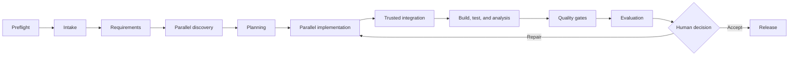

# Multi-Agent AIDLC

A learning-first implementation of an AI-Driven Development Lifecycle built around a deterministic hub, specialist agents, typed artifacts, human approvals, trusted execution, and evidence-based release decisions.

The project demonstrates how an agentic software workflow can remain observable and controlled while using models for the work that benefits from reasoning. The hub owns lifecycle state and policy; agents communicate over A2A, tools are protected through OAuth and MCP, generated projects run in an isolated sandbox, and every stage produces durable evidence.


## What this project demonstrates

- A hub-and-spoke fleet with dedicated intake, requirements, discovery, planning, implementation, validation, evaluation, and release roles
- A2A JSON-RPC/HTTP communication with streamed task and artifact events
- Typed, project-scoped artifacts instead of loose shared conversation memory
- Human clarification and approval surfaces rendered through A2UI
- Parallel specialist work with deterministic fan-out and fan-in
- Isolated backend, frontend, and test generation with trusted source integration
- Offline build, test, and analysis inside a hardened sandbox
- OAuth client credentials and scoped access for MCP analysis
- Deterministic quality gates followed by evidence-based model evaluation
- Bounded repair loops, safe retry, completed-work reuse, and context-aware caching
- Run-level FinOps for tokens, calculated cost, context reduction, repair overhead, retry overhead, and cache effects

## Lifecycle



The lifecycle is a state machine rather than a free-form agent conversation. Required dependencies are selected for each specialist, outputs are validated before persistence, and release is allowed only when the current source and its evidence satisfy the configured gates.

## Architecture at a glance

| Area | Responsibility |
|---|---|
| Hub | Schedules stages, selects context, persists artifacts, routes decisions, enforces repair limits, and controls release |
| Spoke agents | Produce role-specific structured outputs without direct access to host files or arbitrary shell execution |
| A2A fleet | Provides remote-style agent cards, tasks, status updates, and result artifacts over HTTP |
| A2UI surface | Presents allow-listed clarification and approval controls to a human reviewer |
| MCP service | Provides authenticated, artifact-bound static analysis |
| Sandbox | Builds, tests, and analyzes generated source in an isolated offline runtime |
| Evaluation | Combines deterministic gates with rubric-based readiness assessment |
| Artifact store | Maintains current project snapshots, lineage, hashes, and trusted evidence records |

## Prerequisites

- Ubuntu Server 26.04 LTS on `amd64`
- Python 3.14.7
- `uv` 0.12.x
- Node.js 24.21.0
- `pnpm` 12.4.2
- Docker for the local identity provider and default sandbox runtime

The host preflight also inspects optional gVisor and Kata capabilities. The application records degraded host capability when enforcement is explicitly disabled, but it does not install or reconfigure privileged runtimes.

## Quick start

Create the local configuration and provide the selected model credentials, Keycloak administrator secret, and MCP service-client secret:

```bash
cp .env.example .env
uv sync --locked
```

Build and qualify the sandbox before starting the fleet:

```bash
docker compose --env-file .env -f dev/compose.yaml up -d
uv run aidlc-sandbox build-image
uv run aidlc-sandbox qualify
```

Start all services from the repository root:

```bash
./scripts/aidlc.sh start
./scripts/aidlc.sh status
```

Open the UI at [http://127.0.0.1:5173](http://127.0.0.1:5173). The API, agent fleet, MCP service, and Keycloak use ports `8000`, `8001`, `8002`, and `8080` respectively.

Manage the stack with:

```bash
./scripts/aidlc.sh restart
./scripts/aidlc.sh stop
```

The service manager starts dependencies in order, checks readiness, reuses healthy managed services, and shuts them down in reverse order. Runtime databases, artifacts, service logs, and process records remain under the configured data directory.

## Human review and evaluation

The UI shows the active lifecycle, generated artifacts, gate evidence, evaluation scores, and bounded human actions. Human responses resume the same remote task where appropriate and are recorded as durable workflow evidence.

### Evaluation overview


### Evidence and decision detail


## Cost and context controls

The runtime records provider-reported token usage and calculates cost when input and output rates are configured. It also measures selected context against a broader serialized baseline without treating byte reduction as a token or currency estimate.

Cost and effort are controlled through least-context input contracts, safe within-run caching, completed-stage reuse, saved sibling reuse, bounded repairs and clarifications, output-token limits, phase token budgets, concise role prompts, and deterministic handling of integration and quality gates.

## Quality checks

Run the backend checks from the repository root:

```bash
uv run pytest
uv run ruff check .
uv run pyright
```

Run the frontend checks from the UI directory:

```bash
pnpm test
pnpm build
```

## Documentation

The repository documentation is split by purpose:

- [Learning architecture](docs/aidlc-learning-architecture.md) — design principles, stage graph, agent roles, protocols, sandbox model, evaluation strategy, and delivery plan
- [Current implementation analysis](docs/aidlc-project-learning.md) — how A2UI, A2A, Deep Agents, Harbor evaluation, FinOps, OAuth/MCP, sandbox execution, and lifecycle stages work in this repository
- [Agent goals and shared context](docs/aidlc-agent-goals.md) — runtime role contracts, artifact communication, context projection, snapshot semantics, repair behavior, and role boundaries

## Runtime notes

- The local identity and human-action configuration is intended for development and learning.
- MCP and sandbox execution are enabled for the live fleet and failures are explicit.
- Workflow retry reuses valid completed work but does not resume a partially generated model response.
- Browser end-to-end testing and broad dependency or security scanning are outside the current validation profile.
- Generated releases are project artifacts, not deployed applications.

For the full design, begin with the [learning architecture](docs/aidlc-learning-architecture.md). For a code-oriented walkthrough of the running system, use the [current implementation analysis](docs/aidlc-project-learning.md).
