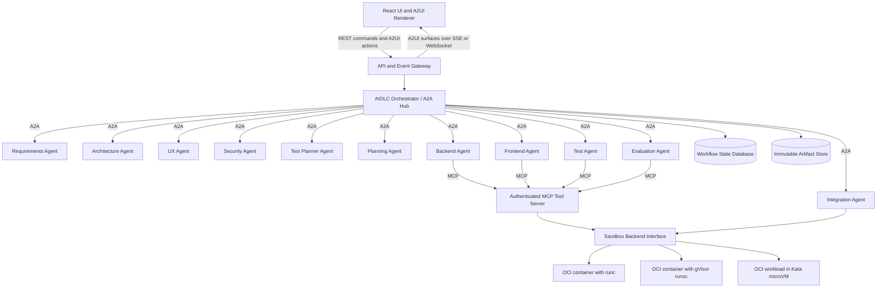
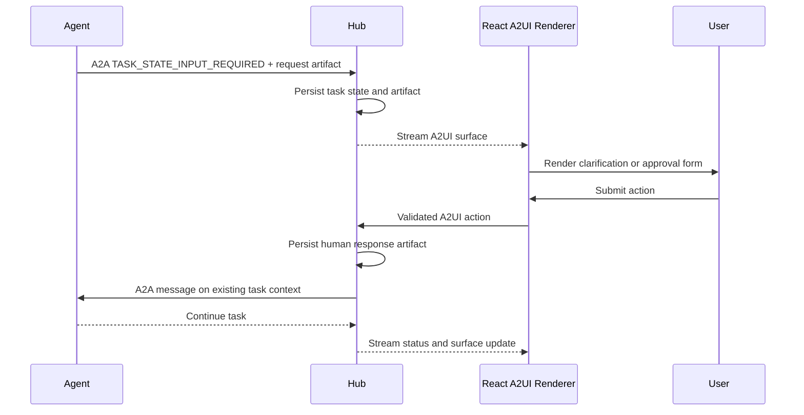

# Agentic AI-Driven Development Lifecycle

## Learning Architecture and Delivery Plan

Current implementation: see [live spoke fleet and React validation](live-fleet.md).
All runnable spokes now use live profiles and shared root `.env` configuration.
Sandbox validation supports pinned React dependency builds and Python tests;
broader gates in this delivery plan remain explicitly tracked limitations.

- **Status:** Accepted proposal
- **Purpose:** Learning exercise
- **Working name:** Multi-Agent AIDLC

## 1. Purpose

This project demonstrates how a one-line product idea can be transformed into a
working minimum viable product (MVP) through an AI-driven development lifecycle
(AIDLC).

The primary goal is not to build the most autonomous code generator possible.
The goal is to learn how to design a multi-agent system that is understandable,
observable, secure, recoverable, and measurable.

The implementation should remain deliberately simple:

- Run all application and sandbox host services on Ubuntu Server 26.04 LTS.
- Use Python for the backend.
- Use `uv` for Python dependency and workspace management.
- Prefer LangChain Deep Agents for agent implementation.
- Configure the agent harness explicitly, even when using framework defaults.
- Use React with TypeScript for the user interface.
- Use A2A for all agent-to-agent communication.
- Use one MCP server for controlled access to external tools.
- Use A2UI for interactive clarification and approval surfaces.
- Run generated code and analysis tools in containers, gVisor, or microVM
  sandboxes through a common backend contract.
- Add comments at architectural boundaries and key learning points.
- Avoid comments that merely repeat what straightforward code already says.

## 2. Learning Outcomes

By completing this project, the learner should be able to explain and
demonstrate:

1. The difference between an agent, an agent harness, a tool, and a workflow.
2. Hub-and-spoke multi-agent orchestration.
3. Serial and parallel agent execution.
4. A2A task, message, artifact, discovery, and lifecycle semantics.
5. The difference between A2A agent communication and MCP tool access.
6. Typed contracts between non-deterministic agents.
7. Durable workflow state, retries, cancellation, and recovery.
8. Human approval gates and bounded autonomy.
9. Authentication and authorization for MCP tools.
10. Safe code execution with standard containers and gVisor.
11. Deterministic and model-based evaluation.
12. Agent observability, cost measurement, and quality regression testing.
13. When a multi-agent design is more useful than a single-agent design.

## 3. Core Architecture Principles

### 3.1 Separate the control plane from the reasoning plane

The orchestrator owns workflow state and decides which stages are eligible to
run. Agents perform reasoning within an assigned stage but do not own the
overall lifecycle.

This avoids hiding workflow behavior inside prompts.

### 3.2 Use deterministic control flow around non-deterministic agents

The following concerns should be implemented in ordinary application code:

- State transitions
- Dependency resolution
- Parallel scheduling
- Retry limits
- Timeouts
- Approval gates
- Schema validation
- Sandbox policies
- Quality thresholds

Agents may recommend actions, but application code enforces the rules.

### 3.3 Use A2A only for agent-to-agent communication

Every lifecycle agent is exposed as an independent A2A server. The hub acts as
an A2A client when delegating work to a spoke.

Deep Agents may be used inside each A2A server as its reasoning harness. The
built-in Deep Agents subagent mechanism must not be presented as A2A
communication because it uses a framework-specific delegation mechanism.

### 3.4 Use MCP only for agent-to-tool communication

Agents do not become MCP servers. They use an MCP client to request a tool from
the shared MCP tool server.

The distinction is:

| Interaction | Protocol | Example |
| --- | --- | --- |
| Orchestrator to Requirements Agent | A2A | Create a requirements artifact |
| Test Agent to Evaluation Agent | A2A through the hub | Review test evidence |
| Code Agent to static-analysis tool | MCP | Run analysis on a code artifact |
| React UI to backend | REST plus A2UI actions and SSE/WebSocket | Start a run, answer questions, and display progress |

### 3.5 Treat artifacts as the source of truth

Agents exchange versioned artifacts instead of relying on shared hidden
conversation history. This makes runs reproducible and allows an artifact to be
inspected, approved, rejected, or replayed.

## 4. High-Level Architecture

For the learning MVP, all deployable components in this diagram run on one
Ubuntu Server 26.04 LTS host. The browser and external model APIs may be remote,
but the React assets, API, agents, local identity provider, MCP server, artifact
store, and sandbox services are hosted on Ubuntu.



## 5. AIDLC Stage Graph

### Platform preflight

Before Stage 0, deterministic application code verifies the Ubuntu host and
available sandbox backends. It publishes a `HostCapabilityReport`. No LLM is
needed for this check.

The workflow may start only when the Ubuntu, storage, `runc`, and `runsc`
requirements pass. Kata is mandatory when the run explicitly requests the
microVM backend; otherwise, a missing KVM capability is recorded as an explicit
degraded-mode limitation.

### Stage 0: Intake and clarification

Input:

- A one-line product idea

Responsibilities:

- Detect ambiguity.
- Identify the target user and primary problem.
- Record assumptions.
- Ask for human clarification only when an answer materially changes the MVP.
- Present required clarification as an interactive, persisted A2UI surface.

Output:

- `ProjectBrief`

### Stage 1: Requirements

The Requirements Agent produces:

- MVP scope
- Functional requirements
- Non-functional requirements
- Acceptance criteria
- Explicit exclusions
- Open questions

Output:

- `RequirementsSpec`

This stage runs serially because its artifact is an input to subsequent stages.

### Stage 2: Parallel discovery

After requirements are approved, the hub starts these agents in parallel:

- Architecture Agent
- UX Agent
- Security Agent
- Test Planner Agent

Each agent receives the same approved requirements artifact but creates an
independent result. Parallel execution demonstrates isolated contexts and
fan-out/fan-in orchestration.

Outputs:

- `ArchitectureDecision`
- `UxSpecification`
- `ThreatModel`
- `TestPlan`

### Stage 3: Integrated planning

The Planning Agent combines the discovery artifacts into a dependency-aware
implementation plan.

The plan must identify:

- Backend tasks
- Frontend tasks
- Test tasks
- Shared contracts
- Integration order
- Expected files and artifacts
- Completion criteria

Output:

- `ImplementationPlan`

### Stage 4: Parallel implementation

The hub runs the following agents in parallel where task dependencies permit:

- Backend Agent
- Frontend Agent
- Test Agent

Each agent works on an isolated source snapshot or branch. Agents return patches
and manifests rather than writing concurrently into one shared working tree.

Outputs:

- `CodeChange`
- `TestChange`
- `DependencyManifest`

### Stage 5: Serial integration and sandbox execution

The Integration Agent applies approved changes in a deterministic order and
runs the result in an isolated environment.

Hard gates include:

- Dependency installation
- Compilation or build
- Formatting and linting
- Type checking
- Unit tests
- Integration tests
- Static code analysis
- Security checks

Outputs:

- `BuildReport`
- `TestReport`
- `StaticAnalysisReport`

### Stage 6: Evaluation

The Evaluation Agent reviews the original idea, requirements, implementation,
and deterministic evidence.

The agent evaluates qualities that are difficult to express as binary tests:

- Requirement coverage
- MVP completeness
- Usability
- Architectural coherence
- Maintainability
- Risk acceptance

Output:

- `EvaluationReport`

### Stage 7: Bounded repair

Failed hard gates or an evaluation score below the configured threshold may
start a repair loop.

The repair loop must be bounded by configuration, for example:

```python
max_repair_attempts = 2
```

Exhausting the limit results in a failed run with evidence. It must not cause an
unbounded agent loop.

### Stage 8: MVP release bundle

The final stage produces:

- Source code
- Dependency lock files
- Run instructions
- Architecture summary
- Test and evaluation reports
- Known limitations
- Artifact provenance

Output:

- `ReleaseBundle`

## 6. Agent Roles

Current storage clarification: every new workflow owns a project folder. Intake establishes project scope; spoke improvements replace current output snapshots. Execution and human-decision evidence remain separate records. This supersedes older references below to immutable phase outputs; cross-run project reopening is not implemented.

See [agent goals and shared context](agent-goals.md) for all 15 implemented spoke goal contracts, artifact transport, and project-scoped current snapshot storage.

Each agent should have one clear responsibility and the minimum set of tools
needed to perform it.

| Agent | Primary responsibility | May change code? |
| --- | --- | --- |
| Requirements | Translate idea into verifiable requirements | No |
| Architecture | Select structure and record trade-offs | No |
| UX | Define user journeys and interface behavior | No |
| Security | Create threat model and security requirements | No |
| Test Planner | Convert acceptance criteria into a test strategy | No |
| Planning | Build the dependency-aware implementation plan | No |
| Backend | Implement backend tasks | Yes, isolated patch |
| Frontend | Implement UI tasks | Yes, isolated patch |
| Test | Implement automated tests | Yes, isolated patch |
| Integration | Apply patches and run deterministic gates | Yes |
| Evaluation | Assess evidence against requirements and rubrics | No |

The orchestrator is not another expert agent. It is the hub responsible for
scheduling, validation, persistence, and policy enforcement.

## 7. A2A Communication Design

### 7.1 Agent discovery

Each agent publishes an A2A Agent Card describing:

- Agent identity
- Endpoint
- Supported protocol version
- Skills
- Input and output content types
- Streaming support
- Authentication requirements

### 7.2 Task mapping

Every delegated lifecycle activity is an A2A task. The hub stores the mapping:

```text
workflow_run_id -> stage_id -> a2a_context_id -> a2a_task_id
```

### 7.3 A2A artifacts

Stage outputs are returned as A2A artifacts containing structured data or a
reference to content in the artifact store.

Large code snapshots should not be copied into every message. Prefer immutable
artifact references with hashes.

### 7.4 Failure behavior

The hub must handle:

- Timeouts
- Agent unavailability
- Invalid artifacts
- Unsupported content types
- Failed and canceled tasks
- Duplicate responses
- Lost streaming connections

Retries must use idempotency identifiers so that a retry does not create a
second logical stage execution.

## 8. Typed Artifact Contracts

Use Pydantic models for artifacts and JSON Schema at service boundaries.

Every artifact should include common metadata:

```python
class ArtifactMetadata(BaseModel):
    schema_version: str
    artifact_id: str
    workflow_run_id: str
    stage_id: str
    parent_artifact_ids: list[str]
    producing_agent: str
    model_id: str | None
    prompt_version: str | None
    created_at: datetime
    content_sha256: str
```

Suggested artifact types:

- `HostCapabilityReport`
- `ProjectBrief`
- `ClarificationRequest`
- `HumanResponse`
- `RequirementsSpec`
- `ArchitectureDecision`
- `UxSpecification`
- `ThreatModel`
- `TestPlan`
- `ImplementationPlan`
- `ProjectMemoryManifest`
- `CodeChange`
- `DependencyManifest`
- `BuildReport`
- `TestReport`
- `StaticAnalysisReport`
- `EvaluationReport`
- `ApprovalRequest`
- `ApprovalDecision`
- `SandboxExecutionReport`
- `ReleaseBundle`

Artifacts must be schema-validated before the hub advances the workflow.

### 8.1 Phase output persistence

The output of each phase is stored in a common artifact repository, but the
repository is not a shared mutable LLM memory or a shared chat transcript.

Use four separate state boundaries:

| Boundary | Contents | Mutability | Initial implementation |
| --- | --- | --- | --- |
| Workflow database | Runs, stages, A2A task IDs, approvals, retries, and artifact metadata | Transactional | SQLite |
| Artifact store | Requirements, designs, patches, reports, and release bundles | Immutable and versioned | Content-addressed local files |
| Source repository | Code snapshots, branches, commits, and diffs | Versioned through Git | Local Git repository |
| Agent working context | Temporary messages, tool results, and scratch notes | Private and disposable | In-memory/checkpointed per task |

For the first implementation, an artifact may be stored at a path similar to:

```text
artifacts/<workflow_run_id>/<stage_id>/<artifact_id>/
├── manifest.json
├── content.json
└── content.md
```

`manifest.json` contains lineage and integrity metadata. `content.json` is the
machine-readable contract. `content.md` is an optional human-readable view.
Large source snapshots may be represented by a Git commit plus a content hash
instead of being duplicated in the artifact directory.

Files must be written atomically. Once published, an artifact is never edited
in place. A correction produces a new artifact ID whose metadata refers to the
superseded artifact.

### 8.2 Project memory view

The hub constructs a `ProjectMemoryManifest` for each agent invocation. It is a
read-only, run-scoped list of approved artifacts and concise summaries relevant
to that agent's task.

For example, the Backend Agent may receive:

- The approved `RequirementsSpec`
- The approved `ArchitectureDecision`
- The relevant portion of the `ImplementationPlan`
- API contracts shared with the Frontend Agent
- References to earlier build or evaluation failures during a repair attempt

It does not automatically receive every prior agent message or private scratch
context. An agent cannot silently modify shared memory; it can only publish a
new candidate artifact for validation and acceptance by the hub.

This provides the useful behavior of a common memory bank while preserving
lineage, isolation, reproducibility, and least-context access. A vector database
or long-term semantic memory is unnecessary for the first MVP and may be added
later only for discovery across many historical runs.

## 9. Durable Workflow State

The lifecycle should be represented as an explicit state machine:

```text
PENDING -> RUNNING -> INPUT_REQUIRED -> COMPLETED
                |
                +-> FAILED
                +-> CANCELED
```

The implementation should support:

- Checkpointing after every state transition
- Process restart and run resumption
- Idempotent stage execution
- Retry with backoff
- Per-stage timeouts
- User cancellation
- Partial failure reporting
- Replay from an approved artifact

SQLite is sufficient for the first learning version. PostgreSQL can be added
later to study concurrency and stronger operational guarantees.

## 10. Human-in-the-Loop Controls

The application should support configurable approval gates after:

1. Requirements
2. Architecture and implementation plan
3. Final evaluation

Two useful modes are:

```python
autonomous_mode = False
require_requirements_approval = True
require_plan_approval = True
require_release_approval = True
```

An approval records the approver, time, artifact hash, and optional comment.
Changing an approved artifact invalidates downstream approvals.

### 10.1 Interactive clarification and approval with A2UI

Clarification and approval requests must be displayed interactively in the
React UI. Use A2UI v0.9.1, the current production protocol baseline, for these
agent-driven surfaces. Keep the A2UI adapter versioned so that v1.0 can be
adopted after it leaves candidate status.

The first component catalog should be intentionally small and allow only:

- Text and Markdown
- Text fields
- Single-choice and multiple-choice controls
- Checkboxes
- Artifact summaries and code diffs
- Approve, reject, revise, submit, and cancel actions

The interaction sequence is:

1. An agent determines that user input is required.
2. The agent returns the A2A task in `TASK_STATE_INPUT_REQUIRED` state with a validated
   `ClarificationRequest` or `ApprovalRequest` artifact.
3. The artifact includes or references an A2UI surface description.
4. The hub persists the request before streaming the A2UI surface to React.
5. React renders the surface using an allowlisted component catalog.
6. The user submits an A2UI action.
7. The API validates the action, user identity, workflow state, surface ID, and
   artifact version.
8. The hub stores an immutable `HumanResponse` or `ApprovalDecision` artifact.
9. The hub sends the response to the same A2A task and context, then resumes the
   workflow.
10. The UI receives the resulting state and surface updates.



A2UI describes presentation and interaction; it does not own workflow state.
The hub remains authoritative for permissions, task state, approvals, and
resumption.

Agent-generated HTML, JavaScript, URLs, or arbitrary components must not be
executed. All A2UI messages are schema-validated and resolved through the
trusted catalog. Duplicate actions use an idempotency key and stale actions are
rejected when their artifact or surface version is no longer current.

## 11. Explicit Agent Harness Configuration

Framework defaults should be represented in application configuration so that
their effect is visible and testable.

An illustrative configuration is:

```python
class HarnessSettings(BaseSettings):
    required_host_os: str = "ubuntu"
    required_host_version: str = "26.04"
    model: str = "provider:model"
    reasoning_effort: str = "medium"
    max_agent_steps: int = 20
    max_parallel_agents: int = 3
    task_timeout_seconds: int = 600
    max_repair_attempts: int = 2
    token_budget_per_phase_per_run: int = 100_000
    sandbox_backend: Literal["runc", "runsc", "kata"] = "runc"
    sandbox_network_enabled: bool = False
    require_kvm_for_microvm: bool = True
    a2ui_protocol_version: str = "0.9.1"
    general_purpose_subagent_enabled: bool = True
    require_plan_approval: bool = True
```

The Deep Agents general-purpose subagent profile should also be constructed
explicitly, even when its values match the framework defaults. This makes the
harness behavior part of the lesson instead of an invisible dependency.

Implementation note: the Milestone 3 profile is constructed explicitly, but
its native `task` tool is disabled. Native Deep Agents delegation is not A2A;
enabling that tool would violate this application's strict agent communication
boundary. Hub-to-specialist calls continue exclusively through A2A servers.
See [Milestone 3 implementation](implementation-milestone.md#milestone-3-deep-agents-and-human-gates) for applied limits
and provider-specific settings that remain declared rather than active.

## 12. Single Authenticated MCP Tool Server

### 12.1 Purpose

The first version contains one MCP server named `aidlc-tools`. It demonstrates
how an agent securely obtains a capability without receiving direct shell or
host access.

The server initially exposes one tool:

```text
analyze_code
```

The implementation may use Ruff as the first Python analyzer. Semgrep, Bandit,
ESLint, or other analyzers can be added later without adding another MCP server.

### 12.2 Transport

Use MCP Streamable HTTP so that the server can apply the MCP HTTP authorization
model. STDIO is useful locally but does not demonstrate the requested OAuth
authentication and authorization flow.

### 12.3 Authentication architecture

The MCP server acts as an OAuth-protected resource server. A separate,
standards-compliant authorization server or identity provider issues access
tokens. The project should not create a custom token format or implement a
home-grown identity provider.

For a local learning environment, a containerized development identity provider
may be used. Its configuration should be committed as declarative development
configuration without committing secrets.

The MCP server validates:

- Token signature
- Issuer
- Expiration and not-before time
- Intended audience or resource
- Required scopes
- Subject or client identity

The MCP server publishes OAuth Protected Resource Metadata and advertises its
authorization server. Unauthorized calls return an appropriate
`WWW-Authenticate` challenge.

### 12.4 Authorization model

Authentication answers *who is calling*. Authorization answers *what that
caller may do*.

Start with these least-privilege scopes:

| Scope | Capability |
| --- | --- |
| `analysis:run` | Invoke the `analyze_code` tool |
| `analysis:read` | Read a stored analysis result |

Authorization must be checked when the tool is invoked, not only when the MCP
session is created.

The initial policy can grant `analysis:run` to the Backend, Frontend, Test,
Integration, and Evaluation Agents. Planning-only agents do not need this
permission.

All access is denied by default. Adding a new tool requires an explicit scope
and policy decision.

### 12.5 Credential handling

- Access tokens are sent in the HTTP `Authorization` header.
- Access tokens are never placed in URL query parameters.
- Tokens are never logged.
- Tokens are never written into artifacts.
- Tokens are never forwarded into the analysis sandbox.
- Tokens must be audience-bound to the MCP server.
- Short token lifetimes are preferred.
- Development secrets are loaded from the environment or a secret store.

The MCP server performs the privileged transition from an authorized tool call
to a constrained sandbox job. The sandbox receives only the sanitized job
input.

### 12.6 Static-analysis tool contract

The tool accepts an immutable artifact reference rather than a host filesystem
path or arbitrary shell command.

Example input:

```json
{
  "artifact_id": "artifact_01J...",
  "content_sha256": "expected-content-hash",
  "language": "python",
  "ruleset": "default",
  "timeout_seconds": 60
}
```

The server must:

1. Authorize the caller for `analysis:run`.
2. Resolve the artifact from the controlled artifact store.
3. Verify its content hash.
4. Copy it into a new ephemeral sandbox.
5. Select an analyzer from a server-side allowlist.
6. Run the analyzer with resource and output limits.
7. Normalize the result into a structured response.
8. Destroy the sandbox workspace.
9. Record a redacted audit event.

Example output:

```json
{
  "analysis_id": "analysis_01J...",
  "status": "completed",
  "tool": {
    "name": "ruff",
    "version": "pinned-version"
  },
  "summary": {
    "errors": 1,
    "warnings": 2
  },
  "findings": [
    {
      "rule_id": "F401",
      "severity": "warning",
      "path": "src/example.py",
      "line": 3,
      "column": 1,
      "message": "Imported name is unused",
      "fingerprint": "stable-finding-id"
    }
  ],
  "execution": {
    "runtime": "runsc",
    "duration_ms": 842,
    "timed_out": false,
    "output_truncated": false
  }
}
```

The tool must not accept raw command text. This prevents the MCP method from
becoming an unrestricted remote shell.

### 12.7 MCP audit events

Record the following without recording tokens or source code:

- Timestamp
- Caller subject or client ID
- Workflow run ID
- Tool name
- Requested artifact ID and hash
- Authorization decision
- Analysis job ID
- Sandbox runtime
- Duration and outcome

Audit records should be correlated with A2A task and workflow trace IDs.

### 12.8 Milestone 4 implementation boundary

The [Milestone 4 implementation](implementation-milestone.md#milestone-4-authenticated-mcp-tools) provides the single SDK
Streamable HTTP server, Keycloak client-credentials identity, discovered JWKS
validation, per-call scopes, artifact-bound Ruff analysis, owner-bound stored
result resources, and redacted audit/workflow events. Source is never executed
by the analyzer. Its runtime is explicitly `local-analyzer`; the ephemeral
workspace and stripped environment are not a sandbox qualification claim.
The [Milestone 5 implementation](implementation-milestone.md#milestone-5-sandboxed-python-jobs) now defaults to
artifact-bound OCI analysis with OS resource/network controls and adds trusted
standalone Python compilation/test jobs. The local analyzer remains an explicit
development option. Later reference agents still produce file-name
proposals, so the opt-in analysis specialist reports missing source explicitly.
Human actions retain the Milestone 3 local identity; browser OAuth is deferred.

## 13. Sandbox Design

### 13.1 Runtime comparison

A Docker image, gVisor, and a microVM are not three equivalent packaging
formats. OCI images package the workload; the selected backend determines the
isolation boundary used to execute it.

The project should support three comparable execution modes behind one sandbox
interface:

| Mode | Backend | Isolation boundary | Learning purpose |
| --- | --- | --- | --- |
| Baseline | OCI container with `runc` | Namespaces, capabilities, seccomp, and the shared host kernel | Establish compatibility and performance baseline |
| Sandboxed container | OCI container with gVisor `runsc` | User-space application kernel between the workload and host kernel | Reduce direct host-kernel syscall exposure |
| MicroVM | Kata Containers through containerd | Lightweight VM with a separate guest kernel | Compare hardware-virtualized isolation with container-compatible operations |

Kata Containers is the preferred first microVM backend because it accepts OCI
workloads through containerd. This allows the same source bundle and tool image
to be evaluated under `runc`, `runsc`, and a microVM with fewer unrelated
packaging differences.

Direct Firecracker support is an optional advanced backend. Firecracker offers
a small virtual machine monitor, but direct integration also requires managing
a guest kernel, root filesystem, TAP networking, block devices, API lifecycle,
and the Firecracker jailer. It should be added only after the common sandbox
contract is stable.

MicroVM execution requires Linux hardware virtualization, normally exposed as
`/dev/kvm`. The application must detect this capability and report the Kata or
Firecracker backend as unavailable. It must not silently claim a microVM test
while falling back to a container.

### 13.2 Common sandbox backend contract

Compilation, validation, tests, and static analysis should call a backend-neutral
interface similar to:

```python
class SandboxBackend(Protocol):
    async def create(self, policy: SandboxPolicy) -> SandboxHandle: ...
    async def upload_artifact(self, handle: SandboxHandle, artifact_id: str) -> None: ...
    async def execute(self, handle: SandboxHandle, command: CommandSpec) -> ExecutionResult: ...
    async def collect_artifacts(self, handle: SandboxHandle) -> list[ArtifactRef]: ...
    async def destroy(self, handle: SandboxHandle) -> None: ...
```

`CommandSpec` contains an allowlisted executable and structured arguments. It
does not contain an arbitrary shell string supplied by an agent.

Every backend must preserve the same observable contract:

- Fresh environment for each job
- Immutable input artifact verification
- Standard working directory layout
- Structured stdout, stderr, exit code, timing, and resource usage
- Explicit network policy
- Output collection followed by teardown
- Backend identity and version recorded in the result

This makes test outcomes comparable and prevents orchestration code from being
tied to Docker-specific commands.

### 13.3 MicroVM compilation and validation flow

For the Kata backend:

1. The hub or MCP server submits a validated job to the sandbox service.
2. The service resolves the approved OCI image by digest.
3. Containerd starts the workload with the Kata runtime.
4. Kata creates a lightweight VM and starts the workload inside the guest.
5. The service copies or mounts a read-only source snapshot into the guest.
6. Compilation, tests, or static analysis run with network and resource limits.
7. Only declared output artifacts and structured execution evidence are
   collected.
8. The workload and VM are destroyed.

Do not share a writable workspace between concurrent agents or reuse a dirty
microVM. Snapshotting or a warm pool may be studied later, but every leased
environment must be reset to a verified clean state.

### 13.4 Required controls

All runtime modes should enforce:

- Non-root execution
- Read-only root filesystem
- Ephemeral writable work directory
- Network disabled by default
- CPU and memory limits
- Process count limit
- Disk or workspace quota
- Wall-clock timeout
- Maximum captured output size
- No host Docker socket
- No host credential mounts
- Pinned tool and dependency versions

The sandbox output should be treated as untrusted input and parsed defensively.

The microVM mode additionally requires:

- KVM capability checks
- A minimal, pinned guest kernel and root filesystem
- No unintended host device passthrough
- Restricted block-device and network configuration
- Kata or Firecracker process isolation on the host
- Guaranteed teardown after timeout, cancellation, or control-plane failure

### 13.5 Comparison experiment

Run the same compilation and validation fixture in all available backends and
record:

- Startup and total execution latency
- Peak memory and CPU usage
- Test and analyzer compatibility
- Filesystem and network isolation results
- Cleanup success after forced timeout
- Operational complexity and failure modes

This comparison teaches the trade-off between container speed, gVisor syscall
mediation, and microVM kernel isolation without assuming one backend is best for
every workload.

## 14. Evaluation Strategy

Evaluation should be layered rather than delegated entirely to one AI agent.

### 14.1 Deterministic evaluation

Use hard gates for:

- Build success
- Unit and integration tests
- Formatting and linting
- Type checking
- Artifact schema validation
- A2A contract tests
- MCP authorization tests
- Static and dependency security analysis

### 14.2 Agentic evaluation

The Evaluation Agent assesses:

- Requirement coverage
- Quality of the final user experience
- Architecture consistency
- Maintainability
- Appropriateness of agent tool usage
- Whether the generated result is truly an MVP

An AI-generated score cannot override a failed hard gate. The final, informed human
Accept/Repair verdict is authoritative and is bound to an evaluation artifact that includes
the exact deterministic gate snapshot.

### 14.3 Harbor

Harbor is the preferred framework for repeatable, end-to-end coding-agent
evaluations in sandboxed environments.

Create a small project-specific dataset containing one-line ideas with:

- Expected capabilities
- Acceptance tests
- Forbidden behaviors
- Resource limits
- Scoring rules

Harbor should be introduced after the basic workflow is reliable. It is an
evaluation harness, not the production workflow engine.

### 14.4 Trace and trajectory evaluation

Optionally use LangSmith to evaluate:

- Final responses
- Individual tool decisions
- Agent trajectories
- Regressions across prompt or model versions

The core application should remain usable without a hosted observability
service by emitting local OpenTelemetry-compatible traces.

## 15. Observability

Every run should expose:

- Workflow, A2A context, and A2A task IDs
- Parent and child relationships
- Stage state transitions
- Agent and prompt versions
- Artifact IDs and hashes
- Tool calls and authorization decisions
- Sandbox commands selected by trusted application code
- Duration, retry count, and outcome
- Token usage and estimated cost
- Human approvals

Do not expose or persist hidden chain-of-thought. Display concise agent status
summaries, tool activity, artifacts, and evidence instead.

## 16. React User Interface

The UI should be an AIDLC workbench rather than a chat screen. It contains a
normal application shell for navigation and monitoring plus an A2UI renderer
for agent-requested clarification, approval, and revision surfaces.

Minimum views:

1. **Idea submission** — enter the one-line idea and execution options.
2. **Platform status** — show Ubuntu, runtime, KVM, capacity, and degraded-mode
   preflight results.
3. **Workflow graph** — show pending, active, completed, failed, and blocked
   stages.
4. **Live activity** — show A2A status updates and safe operational summaries.
5. **Artifacts** — inspect and compare stage outputs.
6. **Approvals** — approve, reject, or request a revision.
7. **Code changes** — display generated patches and affected files.
8. **Sandbox output** — show builds, tests, and static-analysis findings.
9. **Evaluation** — display deterministic gates and AI evaluation separately.
10. **Operations** — cancel, retry, or resume a run.
11. **Metrics** — show latency, tokens, cost, retries, and quality scores.

The UI communicates with the application backend using:

- REST for workflow commands such as start, cancel, retry, and resume
- SSE initially for ordered workflow and A2UI surface updates
- Validated A2UI action requests from the renderer to the backend
- WebSocket as an optional later replacement when full-duplex interaction is
  demonstrably useful

The browser is not an A2A peer. The backend translates persisted user actions
into A2A messages for the appropriate task.

### 16.1 A2UI rendering rules

- Target A2UI protocol v0.9.1 for the first implementation.
- Use the maintained web core and React renderer rather than implementing the
  protocol state machine from scratch.
- Advertise the renderer's catalog and protocol capabilities.
- Validate every streamed message before applying it.
- Allocate globally unique, run-scoped surface IDs.
- Render only components registered in the trusted catalog.
- Keep local form state in the renderer until the user submits an action.
- Include artifact and surface versions in actions to reject stale decisions.
- Persist requests and responses so a browser refresh does not lose a pending
  clarification.
- Provide an accessible non-generative fallback form for unsupported surfaces.

## 17. Suggested Technology Stack

### 17.1 Versioning policy

The following baseline was verified on **2026-09-16**. It is a reproducible
starting point, not an instruction to upgrade dependencies automatically.

- Declare compatible direct-dependency constraints in `pyproject.toml` and
  `package.json`.
- Commit `uv.lock` and `pnpm-lock.yaml`; those lock files are authoritative for
  transitive versions.
- Pin OCI images by digest, not only by a mutable tag.
- Pin gVisor by dated release and pin Kata/Firecracker by release version.
- Record protocol versions independently from SDK versions.
- Upgrade one protocol or framework family at a time and rerun contract and
  evaluation suites before accepting the new lock files.

### 17.2 Initial version baseline

| Area | Technology | Initial version or protocol baseline |
| --- | --- | --- |
| Host operating system | Ubuntu Server | 26.04 LTS (Resolute); accept supported 26.04.x point releases |
| Host kernel | Ubuntu GA generic Linux kernel | 7.0 series with Ubuntu security updates |
| Baseline CPU architecture | AMD64 / x86-64 | Required for the first implementation |
| Backend language | Python | 3.14.7 |
| Python package manager | `uv` | 0.12.15 |
| API | FastAPI | 0.141.1 |
| Validation | Pydantic | 2.13.5 |
| Agent harness | Deep Agents | 0.7.14 |
| Durable agent runtime | LangGraph | 1.2.11 |
| Agent protocol | A2A specification | 1.0 |
| Agent SDK | `a2a-sdk` | 1.1.2 |
| Tool protocol | MCP over Streamable HTTP | Specification 2026-07-28 |
| Tool SDK | MCP Python SDK | 2.2.0 |
| Development identity provider | Keycloak | 26.7.3 |
| Workflow persistence | SQLite | Version supplied by Python 3.14 initially |
| UI runtime | Node.js LTS | 24.21.0 |
| UI | React and React DOM | 19.3.0 |
| UI language | TypeScript | 7.0.2 |
| UI package manager | `pnpm` | 12.4.2 |
| UI build tool | Vite | 8.3.0 |
| Agent-driven UI protocol | A2UI | 0.9.1 production baseline |
| A2UI state core | `@a2ui/web_core` | 0.11.0 |
| A2UI React renderer | `@a2ui/react` | 0.11.1 |
| Event delivery | SSE | HTTP streaming; no separate package baseline |
| Telemetry | OpenTelemetry Python SDK | 1.44.0 |
| Test framework | `pytest` | 9.1.1 |
| Python linting and initial analyzer | Ruff | 0.16.7 |
| Type checking | Pyright | 1.1.414 |
| Evaluation harness | Harbor | 0.23.0 |
| Container engine | Docker Engine | 29.6.2 |
| Container runtime service | containerd | 2.2.6 from the Docker Engine baseline |
| Standard OCI runtime | `runc` | Version bundled and locked with the engine |
| Sandboxed OCI runtime | gVisor `runsc` | `release-20260907.0` |
| MicroVM-compatible OCI runtime | Kata Containers | 4.2.0 |
| Optional direct microVM backend | Firecracker | 1.17.0 |

Before implementation, verify that the selected A2UI renderer release supports
the targeted v0.9.1 catalog and run a renderer contract fixture. Package and
protocol versions do not necessarily advance together.

### 17.3 Supported Ubuntu baseline

For this project, **Ubuntu 26.x means Ubuntu Server 26.04 LTS**, including its
supported 26.04.x point releases. Do not treat Ubuntu 26.10 or future interim
releases as implicitly compatible. They require a separate qualification run.

The first implementation targets native `amd64`/`x86_64`. Ubuntu `arm64` may be
added later after all Python wheels, Node packages, OCI images, gVisor assets,
Kata assets, and evaluation fixtures pass the same test suite on that
architecture.

Use the Ubuntu GA generic kernel and apply Ubuntu security updates. Do not pin a
kernel patch forever merely to keep the environment reproducible; instead,
record the exact kernel in every sandbox report and rerun the runtime smoke
suite after a kernel update.

### 17.4 Recommended host capacity and features

Ubuntu's minimum installation requirements are not sufficient guidance for a
multi-agent build host running several isolated workloads. Use this development
baseline:

| Host capability | Recommended baseline | Required? |
| --- | --- | --- |
| CPU | 4 physical or virtual cores with AMD-V or Intel VT-x | Four cores recommended; virtualization required for Kata |
| Memory | 16 GiB | 8 GiB minimum for reduced concurrency |
| Disk | 80 GiB SSD-backed storage | Size may vary, but quotas are mandatory |
| Init and services | `systemd` | Yes |
| Control groups | cgroup v2 | Yes |
| Linux security module | AppArmor enabled | Yes |
| Hardware virtualization | `/dev/kvm` accessible to the sandbox service | Required only for Kata or Firecracker |
| Kata communication modules | `vhost_vsock` and `vhost_net` | Required for Kata |
| Initial network access | Package, image, and model downloads | Yes during provisioning; denied in execution sandboxes by default |

If Ubuntu itself runs inside a VM, the outer hypervisor must expose nested
virtualization. Merely seeing Ubuntu 26.04 in `/etc/os-release` does not prove
that Kata or Firecracker can run.

### 17.5 Runtime installation ownership

Avoid mixing distribution and upstream runtime packages without an explicit
plan. Use one package owner for each host component:

1. Install Docker Engine from Docker's official Ubuntu `apt` repository. Docker
   officially supports Ubuntu Resolute 26.04 LTS.
2. Do not install Ubuntu's `docker.io`, `containerd`, or `runc` packages on top
   of Docker CE's `docker-ce`, `containerd.io`, and bundled `runc` packages.
3. Install the pinned gVisor release from its official repository or verified
   release archive, keep `runsc` and its `gvisor-bin` sidecars together, and
   register `runsc` with Docker.
4. Install Kata Containers 4.2.0 from verified release artifacts and register
   its recommended Rust runtime shim with the host containerd service.
5. Run `kata-runtime check` during provisioning and after host kernel or
   virtualization changes.
6. Run Keycloak, the API, agents, MCP server, UI server, and telemetry collector
   as containers or unprivileged system services on the Ubuntu host.

The provisioning process should be an idempotent script or configuration file,
not a collection of undocumented manual commands. Package versions and artifact
checksums should be recorded in a generated host manifest.

### 17.6 Ubuntu preflight report

Before starting an AIDLC run, create a machine-readable `HostCapabilityReport`
that records:

- `/etc/os-release` reports `ID=ubuntu` and `VERSION_ID=26.04`
- Host architecture is `x86_64` for the initial baseline
- Exact kernel from `uname -r`
- cgroup v2 is active
- AppArmor is enabled
- Docker daemon and containerd are healthy
- Registered Docker/containerd runtimes and their versions
- A simple pinned image succeeds under `runc`
- The same image succeeds under `runsc`
- `/dev/kvm` permissions and CPU virtualization flags
- `vhost_vsock` and `vhost_net` availability
- Kata runtime check and a minimal Kata workload result
- Available CPU, memory, and disk space
- Required local ports and any detected conflicts

The report is stored as a run artifact and displayed in the UI before the first
build. A missing mandatory baseline capability blocks the run with an actionable
message.

### 17.7 Degraded mode without KVM

On an Ubuntu 26.04 VM without nested virtualization:

- `runc` remains available.
- `runsc` remains available because it does not require KVM.
- Kata and direct Firecracker are marked `UNAVAILABLE`, not `FAILED`.
- MicroVM comparison tests are reported as skipped with the capability evidence.
- The UI warns that the run did not validate the microVM isolation path.

There must be no silent fallback from `kata` to `runc` or `runsc`.

### 17.8 Ubuntu host security notes

- Run the application, agents, and UI as non-root users.
- Treat membership in the `docker` group and access to the Docker/containerd
  socket as host-root-equivalent privileges.
- Give runtime socket and `/dev/kvm` access only to the sandbox service, never
  directly to an agent or generated program.
- Keep AppArmor enabled and apply explicit profiles where the selected runtime
  supports them.
- Bind the learning UI, API, Keycloak, and telemetry endpoints to loopback by
  default. Require an authenticated reverse proxy before remote exposure.
- Docker-published ports can bypass uncomplicated firewall (`ufw`) rules. Avoid
  unnecessary published ports and enforce host policy in the `DOCKER-USER`
  chain.
- Never mount the host Docker socket, user home directory, SSH directory, or
  cloud credentials into an agent sandbox.
- Use `uv` environments for application Python. Do not replace or mutate
  Ubuntu's system Python installation.

## 18. Recommended Experiments

Run the same curated set of ideas through multiple configurations:

1. Single agent versus hub-and-spoke agents
2. Serial versus parallel discovery and implementation
3. Shared context versus artifact-isolated context
4. No evaluator versus evaluator and bounded repair
5. `runc` versus `runsc` versus Kata microVM
6. Different model or reasoning budgets
7. MCP authorization enabled versus an intentionally failing scope test
8. Workflow interruption followed by checkpoint recovery

Measure:

- Acceptance-test pass rate
- Requirement coverage
- End-to-end latency
- Agent and tool failures
- Token use and estimated cost
- Number of repair cycles
- Human interventions
- Security policy violations
- A2A and MCP protocol errors

These experiments turn the project from a demonstration into an engineering
study.

## 19. Delivery Milestones

### Milestone 1: Deterministic skeleton

- Provision and qualify an Ubuntu Server 26.04 LTS host.
- Implement the deterministic `HostCapabilityReport` preflight.
- Verify `runc`, `runsc`, and KVM/Kata capability before starting agent work.
- Create the Python and React workspaces.
- Implement the workflow state machine.
- Use deterministic fake agents.
- Add artifact schemas and persistence.
- Store phase outputs in the workflow database, immutable artifact store, and
  Git according to their data type.
- Show workflow progress and persisted artifacts in the UI.

### Milestone 2: A2A orchestration

- Expose fake agents as A2A servers.
- Add Agent Cards.
- Implement serial and parallel scheduling.
- Add streaming status, cancellation, and retries.
- Add A2A conformance and contract tests.

### Milestone 3: Deep Agents

- Replace fake agents one at a time.
- Define explicit harness defaults.
- Add structured outputs and validation.
- Add interactive A2UI clarification and approval gates.
- Record model, prompt, token, and cost metadata.

### Milestone 4: Authenticated MCP tool server

- Add the single `aidlc-tools` MCP server.
- Integrate an OAuth/OIDC development provider.
- Add protected resource metadata and token validation.
- Implement `analysis:run` and `analysis:read` scopes.
- Expose the `analyze_code` tool.
- Add positive and negative authorization tests.

### Milestone 5: Sandboxing

- Build a pinned analysis and build image.
- Run with `runc` and strict resource controls.
- Add the `runsc` runtime option.
- Add Kata Containers as the microVM backend when KVM is available.
- Keep direct Firecracker integration as an optional advanced exercise.
- Verify that credentials and network access are unavailable in the sandbox.
- Compare `runc`, `runsc`, and Kata compatibility, isolation, and overhead.

### Milestone 6: Evaluation

- Add deterministic quality gates.
- Add the Evaluation Agent.
- Add bounded repair.
- Create a Harbor dataset.
- Run the comparative experiments.

## 20. Definition of Done

The learning exercise is complete when it can demonstrate all of the following:

- The application stack runs on Ubuntu Server 26.04 LTS `amd64`.
- The UI displays a persisted `HostCapabilityReport` before agent execution.
- `runc` and `runsc` smoke tests pass on the qualified Ubuntu host.
- Kata passes its microVM smoke test when KVM is available, or the UI and final
  report clearly identify the unavailable microVM capability.
- A user submits a one-line idea.
- The workflow produces a reviewable MVP and evidence bundle.
- At least one stage executes serially.
- At least two independent stages execute in parallel.
- All agent-to-agent communication is observable A2A traffic.
- Each agent publishes an Agent Card.
- Stage boundaries use validated, versioned artifacts.
- Phase outputs survive process and browser restarts without relying on agent
  conversation history.
- The workflow resumes safely after an orchestrator restart.
- A clarification or approval request renders as a validated A2UI surface.
- A user response is persisted and resumes the same A2A task context.
- An agent invokes authenticated static analysis through the single MCP server.
- A caller without the required scope is denied.
- The analysis tool runs without receiving the caller's token.
- Generated code is tested in `runc`, `runsc`, and Kata modes when KVM is
  available; an unavailable microVM backend is reported explicitly.
- Deterministic gates remain separate from AI evaluation.
- A failed evaluation can start only a bounded number of repair attempts.
- The UI shows progress, artifacts, approvals, tool activity, and evaluation.
- At least one controlled experiment compares two orchestration configurations.

## 21. Out of Scope for the First MVP

To keep the exercise understandable, defer:

- Ubuntu 26.10, non-Ubuntu hosts, and `arm64` platform qualification
- Kubernetes deployment
- Multiple MCP servers
- A custom identity provider
- Unrestricted shell tools exposed through MCP
- Automatic production deployment
- Long-term semantic memory
- Large model-routing systems
- Multi-tenant billing
- Autonomous changes to external repositories
- Direct Firecracker integration and microVM warm-pool optimization

These can be introduced after the basic contracts, security boundaries, and
evaluation methodology are working.

## 22. References

- [A2A protocol specification](https://github.com/a2aproject/A2A/blob/main/docs/specification.md)
- [Official A2A Python SDK](https://github.com/a2aproject/a2a-python)
- [LangChain Deep Agents overview](https://docs.langchain.com/oss/python/deepagents/overview)
- [LangChain Deep Agents subagents](https://docs.langchain.com/oss/python/deepagents/subagents)
- [MCP authorization specification](https://modelcontextprotocol.io/specification/2026-07-28/basic/authorization)
- [MCP tools specification](https://modelcontextprotocol.io/specification/2026-07-28/server/tools)
- [A2UI protocol v0.9.1](https://github.com/a2ui-project/a2ui/blob/main/specification/v0_9_1/docs/a2ui_protocol.md)
- [A2UI renderer implementation guide](https://github.com/a2ui-project/a2ui/blob/main/docs/public/guides/renderer-development.md)
- [gVisor architecture](https://github.com/google/gvisor/blob/master/g3doc/README.md)
- [gVisor installation and release pinning](https://gvisor.dev/docs/user_guide/install/)
- [Kata Containers architecture](https://github.com/kata-containers/kata-containers/blob/main/docs/index.md)
- [Firecracker design](https://github.com/firecracker-microvm/firecracker/blob/main/docs/design.md)
- [Ubuntu 26.04 LTS release notes](https://documentation.ubuntu.com/release-notes/26.04/)
- [Docker Engine installation on Ubuntu](https://docs.docker.com/engine/install/ubuntu/)
- [Kata Containers installation requirements](https://github.com/kata-containers/kata-containers/blob/main/docs/installation.md)
- [Python releases](https://www.python.org/downloads/)
- [Docker Engine 29 release notes](https://docs.docker.com/engine/release-notes/29/)
- [Harbor evaluation framework](https://github.com/harbor-framework/harbor)
- [LangSmith evaluation approaches](https://docs.langchain.com/langsmith/evaluation-approaches)
