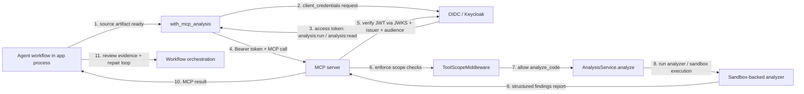
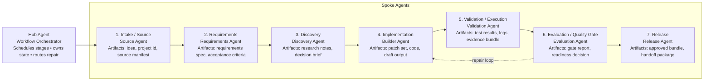

# GitHub Copilot Analysis: current AIDLC implementation

This document captures the lifecycle that is actually implemented in the repository today, close to the code paths in the backend and the agent catalog. It is meant to align the learning plan in `aidlc-learning-architecture.md` with the working implementation that exists in the codebase.

## Source of truth in code

The concrete execution order is defined in:

- `src/aidlc/orchestration/workflow.py`
- `src/aidlc/agents/catalog.py`
- `src/aidlc/a2a/server.py`
- `src/aidlc/a2a/client.py`
- `src/aidlc/domain/models.py`

The orchestration engine is `WorkflowOrchestrator`, and the stage definitions and agent catalog are in `AGENT_SPECS` and `AGENTS_BY_STAGE`.

---

## What is A2UI?

A2UI stands for Agent-to-User Interface. In this project, it is the human-in-the-loop interaction layer used to present small, controlled prompts to a user and capture a decision back into the workflow.

The implementation is centered on:

- `src/aidlc/human.py` — defines the allow-listed A2UI catalog and builds the message payloads in Python
- `src/aidlc/orchestration/workflow.py` — creates human interaction requests, waits for responses, and resumes the run
- `ui/src/HumanSurface.tsx` — validates A2UI payloads and renders the interaction using the React A2UI packages
- `ui/package.json` — declares the frontend libraries: `@a2ui/react` and `@a2ui/web_core`

The server owns the catalog, the prompt, the artifact being reviewed, and the workflow state. The React client renders only a validated A2UI surface and submits the user’s decision back to the server. This keeps the model out of arbitrary UI generation and preserves a clear trust boundary.

### A2UI in this repo

The current catalog includes only:

- `Column`
- `Text`
- `TextField`
- `Button`

On the Python side, the server assembles standard A2UI v0.9.1 message objects as plain dictionaries in `surface_messages()`. On the React side, the app imports the real A2UI rendering and validation packages from `@a2ui/react/v0_9` and `@a2ui/web_core/v0_9`.

The server creates a full message sequence using `createSurface`, `updateComponents`, and `updateDataModel`. The frontend validates the message envelope and confirms that both the catalog ID and the component types match the server’s allow-list before rendering. Once the human responds, the action is persisted and the workflow continues.

The full human form generated by the server looks like this:

```python
[
  {
    "version": "v0.9.1",
    "createSurface": {"surfaceId": surface_id, "catalogId": "urn:aidlc:human-controls:v1"}
  },
  {
    "version": "v0.9.1",
    "updateComponents": {
      "surfaceId": surface_id,
      "components": [
        {
          "id": "root",
          "component": "Column",
          "children": ["question", "answer", "button-submit"]
        },
        {"id": "question", "component": "Text", "text": question, "variant": "caption"},
        {"id": "answer", "component": "TextField", "label": "Your answer", "value": {"path": "/answer"}},
        {
          "id": "button-submit",
          "component": "Button",
          "child": "label-submit",
          "action": {"event": {"name": "submit", "context": {"answer": {"path": "/answer"}}}}
        }
      ]
    }
  },
  {
    "version": "v0.9.1",
    "updateDataModel": {"surfaceId": surface_id, "path": "/", "value": {"answer": ""}}
  }
]
```

This means A2UI here is best understood as a safe, bounded UI protocol for clarifications, approvals, and evaluation decisions.

---

## What is A2A?

A2A stands for Agent-to-Agent. In this project, it is the communication protocol used between the hub orchestrator and the specialist spoke agents.

The implementation is centered on:

- `src/aidlc/a2a/client.py` — the hub-side A2A client and invocation logic
- `src/aidlc/a2a/server.py` — the spoke-side A2A server and FastAPI routing
- `src/aidlc/a2a/task_store.py` — persistent task/context tracking for A2A work  `SQLiteTaskStore`. It persists A2A task/context data to a local SQLite database typically named `a2a-tasks.sqlite3` under the configured data directory. This makes the task lifecycle durable even when the fleet and hub are started in one process.
- `src/aidlc/orchestration/workflow.py` — schedules A2A tasks, waits for completion, and resumes the run with the returned artifact

The repo uses the official Python A2A SDK, including imports such as `from a2a.client import ...`, `from a2a.server.agent_execution import AgentExecutor`, and `add_a2a_routes_to_fastapi(...)`. The hub and the spoke agents communicate through A2A 1.0 JSON-RPC over HTTP with task lifecycle events and streamed status updates.

Even when all agents run in a single process, the hub still uses the A2A/REST boundary because each specialist is exposed as a separate FastAPI A2A route, the client resolves agent cards over HTTP, and the workflow enforces a strict A2A-only delegation policy. That keeps agent communication remote-like, observable, and replayable, instead of collapsing into an in-memory shortcut that would blur execution boundaries and weaken task durability.

### A2A in this repo

A2A is used for the actual agent delegation boundary. The orchestrator does not call specialists in-process; it sends delegated work to a remote agent endpoint, waits for task status changes, and collects the resulting artifact payload.

The implementation follows a typical A2A flow:

1. The hub resolves an agent card for a specialist.
2. It creates or resumes an A2A task and context for the delegated work.
3. The spoke agent receives the task and executes the specialist step.
4. The spoke emits status and artifact events.
5. The hub validates the returned artifact and persists it as a workflow artifact.

---

## LangChain Deep Agents and the agent harness

LangChain Deep Agents are used as the execution harness for each specialist role, not as the cross-agent transport layer. The implementation is centered in `src/aidlc/agents/deep.py` and is the code path that turns a role definition into a structured model-driven workflow.

### Functionality

The repo relies on a few specific LangChain capabilities:

- `create_deep_agent(...)` builds the per-role graph for an agent such as architecture, requirements, implementation, validation, or release.
- `StateBackend()` gives each invocation its own in-memory virtual file/state context; this keeps the specialist isolated from the host filesystem while still supporting structured task state.
- `ModelCallLimitMiddleware(...)` enforces the run-step cap so the agent cannot recurse indefinitely or drift into uncontrolled loops.
- `ToolStrategy(schema, handle_errors=repair_output)` binds the model to a strict structured-output schema and repairs invalid output automatically.
- `init_chat_model(...)` selects the provider/model backend used by the agent.
- `UsageMetadataCallbackHandler` captures provider usage metadata and token accounting for observability and FinOps reporting.
- `HumanMessage`, `SystemMessage`, and `AIMessage` drive the invocation state and message history passed into the graph.
- `specialist_tool_policy(...)` strips the tool list to an allow-list and injects the role-specific system prompt before the model runs, which prevents general-purpose tool access and keeps each specialist inside its ownership boundary.
- `settings.general_purpose_subagent_enabled` is explicitly blocked, so the system never falls back to native Deep Agent delegation; all delegation must remain on the A2A path.
- `repair_output(...)` creates a repair loop that retries invalid output until the schema is satisfied or the repair budget is exhausted.
- `provider_options` switches OpenAI-backed runs to `use_responses_api=True`, which is the project’s required compatibility mode for structured responses on OpenAI reasoning models.
- `goal_instructions(...)` adds a strong contract layer: the prompt tells the model to use only trusted artifact snapshots, never invent missing evidence, and never claim tool execution that did not happen.
- `trace.graph_result(output, attempt)` records structured graph output after every attempt, which makes the run observable and gives the workflow evidence for repair and evaluation decisions.

---

## Harbor evaluation harness

Harbor is used as the project’s external evaluation harness for benchmarking generated implementations against a fixed task definition.

The implementation is centered on:

- `evaluation/harbor/tasks` — task definitions for benchmark scenarios such as `task-list` and `expense-totals`
- `tests/test_harbor_dataset.py` — verifies that trusted oracle implementations pass and broken implementations fail
- `docs/implementation-milestone.md` — documents the Harbor task layout, verifier flow, and environment constraints

Each Harbor task contains a one-line idea, explicit capabilities and forbidden behaviors, resource limits, a pinned Python environment, acceptance tests, and an oracle solution. The verifier runs the candidate app against these tests and writes the reward to `/logs/verifier/reward.txt` with a value of `1` when all acceptance tests succeed, otherwise `0`. In the repo, this is exercised in `test_harbor_verifiers_reward_oracles_and_reject_broken_implementations()`, which confirms the same contract in a deterministic test harness.

A concrete example from the repo is the `task-list` benchmark. Its task definition in `evaluation/harbor/tasks/task-list/task.toml` states that the app must support `add`, `list`, and `complete`, reject invalid input, and remain process-local with no network or shell access. The acceptance test in `evaluation/harbor/tasks/task-list/tests/test_acceptance.py` drives the candidate app with a sequence like:

```python
[
    '{"action":"list"}',
    '{"action":"add","title":" Homework "}',
    '{"action":"complete","id":1}',
    '{"action":"complete","id":1}',
    '{"action":"list"}',
]
```

and expects the output to be:

```python
[
    [],
    {"id": 1, "title": "Homework", "completed": False},
    {"id": 1, "title": "Homework", "completed": True},
    {"id": 1, "title": "Homework", "completed": True},
    [{"id": 1, "title": "Homework", "completed": True}],
]
```

The same test file also verifies that malformed input does not mutate state, repeated completion is idempotent, and the implementation cannot use `eval`, `exec`, or other forbidden dynamic execution. The verifier shell script in `evaluation/harbor/tasks/task-list/tests/test.sh` wraps the run in `python -m unittest discover`, and it writes `1` to `reward.txt` only if every acceptance test passes. If the app is broken, it writes `0` instead, which is exactly the signal the evaluation harness uses to grade the result.

This is the same pattern as the rest of the architecture: the workflow produces artifacts, the sandbox or external evaluator validates them, and the resulting evidence informs the gate or repair loop. Harbor is therefore best understood as the benchmark/evaluation layer in the stack, while A2A, A2UI, Deep Agents, and MCP remain the operational layers that drive execution, interaction, and tool access.

### Harbor example

Harbor is an external benchmark harness. The task definition specifies the environment and requirements; the verifier then checks whether the candidate implementation passes the acceptance tests.

Typical invocation:

```bash
uvx --from harbor==0.23.0 harbor run \
  --path evaluation/harbor/tasks --agent oracle
```

Typical verification pattern:

```text
$ bash evaluation/harbor/tasks/task-list/tests/test.sh
PASS: all task-list checks passed
reward.txt: 1
```

And for a broken implementation:

```text
FAIL: validation error in todo.py
reward.txt: 0
```

Summary: Harbor is not the workflow engine; it is the benchmark layer. It converts a fixed task definition into a score and gives the project a repeatable pass/fail signal for model-generated implementations.

---

## FinOps, measurement, and cost optimization

FinOps makes AI usage visible by explaining the usage and reducing effort without weakening correctness. The run report provides totals and per-agent measurements for provider-reported input and output tokens, calculated cost when pricing is configured, successful outputs, cache hits, repair usage, retry usage, and tokens per successful output.

Cost optimization is built into the workflow through:

- role-based context selection
- safe output caching based on model, prompt, contract, artifact lineage, repair state, and relevant runtime settings
- reuse of completed stages and saved parallel outputs after a workflow retry
- bounded repair, clarification, and agent-step loops
- cumulative token budgets for each workflow phase
- concise-output guidance that limits unnecessary prose and speculative scope
- deterministic services for integration, validation, gates, and release checks

---

## OAuth + MCP flow in the current implementation

### Summary

The agents and the MCP tool service are intentionally separate execution boundaries.

- The workflow orchestration and specialist agents run in the main application process.
- The MCP analysis tool is exposed as a separate authenticated HTTP service.
- The agent does not authenticate as a human user; it uses a service account with OAuth client credentials.
- The client requests an access token from the OIDC provider (Keycloak), then sends it in the `Authorization: Bearer ...` header to the MCP endpoint.
- The MCP server does not trust the token blindly: it reads the issuer metadata from the configured OIDC URL, then fetches the signing keys from the issuer’s JWKS endpoint and uses those public keys to validate the JWT signature.
- After signature validation, the server checks the audience, expiration, and required scopes before executing the tool.
- The result is structured analysis evidence that is fed back into the agent review loop.

This design is implemented in:

- `src/aidlc/tools/client.py` — OAuth client credentials flow and MCP tool invocation
- `src/aidlc/tools/auth.py` — token verification and scope enforcement
- `src/aidlc/tools/server.py` — MCP server auth middleware and tool authorization checks
- `src/aidlc/agents/analysis.py` — agent wrapper that calls the protected MCP tool

### Runtime flow



### Auth details from the actual implementation

- `ToolsClient._token()` in `src/aidlc/tools/client.py` obtains a bearer token using the OAuth client-credentials flow.
- `OIDCTokenVerifier.verify_token()` in `src/aidlc/tools/auth.py` resolves the OIDC issuer metadata and fetches the JWKS from the configured issuer URL (`issuer/.well-known/openid-configuration` -> `jwks_uri`) before verifying the JWT signature.
- `permitted()` enforces the scope requirements (`analysis:run`, `analysis:read`) and rejects expired or invalid tokens.
- `ToolScopeMiddleware` in `src/aidlc/tools/server.py` performs a second gate at the HTTP layer before the tool request is processed.

This is the security boundary between the orchestration runtime and the MCP execution service.

---

## Sandbox - Runtime capability

### Docker sandbox

The sandbox is implemented as a hardened Docker runtime that executes generated source in an isolated worker image. The image is defined by the repo’s sandbox stack, especially [sandbox/Dockerfile](../sandbox/Dockerfile), [sandbox/worker.py](../sandbox/worker.py), and the pinned runtime metadata produced by [src/aidlc/sandbox/cli.py](../src/aidlc/sandbox/cli.py). The image is built with a deterministic Docker build and pinned to a SHA-256 image ID before execution; this prevents mutable tags from being used after verification.

Security posture is intentionally strict. In [src/aidlc/sandbox/runner.py](../src/aidlc/sandbox/runner.py), the container is created with:
- `--network=none`
- `--read-only`
- `--user=65532:65532`
- `--cap-drop=ALL`
- `--security-opt=no-new-privileges=true`
- `--memory`, `--cpus`, `--pids-limit`
- no host bind mounts, no host sockets, and no declared image volumes
- `tmpfs` mounts for `/workspace` and `/tmp`

This is a container-hardening pattern. The runtime explicitly rejects host mounts, host credentials, privileged execution, and network access. The worker also verifies runtime isolation in `probe()` in [sandbox/worker.py](../sandbox/worker.py), checking things like no capabilities, no new privileges, read-only root, bounded tmpfs, and network denial.

Artifact transfer into the container is not done with Docker `COPY` or a Docker volume. The source is first materialized as a `SourceBundle` object in [src/aidlc/sandbox/models.py](../src/aidlc/sandbox/models.py), then serialized as JSON and sent over `stdin` during container attach. In [src/aidlc/sandbox/runner.py](../src/aidlc/sandbox/runner.py), the start call sends:
- `payload=job.source.model_dump_json().encode()`
- then the worker reads that payload from `sys.stdin` in [sandbox/worker.py](../sandbox/worker.py)
- each file inside the payload is written to `/workspace/<path>` before the selected mode runs

This means the source gets into the container as a structured JSON payload, not as a bound directory or mounted volume. The permission model and tmpfs design then ensure the workload only sees a constrained ephemeral workspace.

Key interaction points:
- [src/aidlc/sandbox/cli.py](../src/aidlc/sandbox/cli.py): `execute_artifact()` loads artifact, validates hash, constructs `SandboxJob`
- [src/aidlc/sandbox/models.py](../src/aidlc/sandbox/models.py): `SandboxJob`, `SandboxPolicy`, runtime metadata
- [src/aidlc/sandbox/runner.py](../src/aidlc/sandbox/runner.py): `DockerSandbox.execute()` and `DockerSandbox._execute()`
- [sandbox/worker.py](../sandbox/worker.py): `main()`, `probe()`, and the file materialization logic

### AIDLC phase usage

#### Preflight / qualification
The sandbox is first used to verify the runtime itself. `qualify()` and `latest_qualification()` in [src/aidlc/sandbox/cli.py](../src/aidlc/sandbox/cli.py) run a fixture workload through the container to confirm the image and runtime are safe and functional. Tools: `DockerSandbox.execute()`, `SandboxJob`, `probe()`.

#### Implementation / merge
Generated code is merged into a single source snapshot, then handed to the sandbox for validation. This is the transition from “generated code exists” to “generated code is executable and reviewable.” Tools: `current_sources()`, `execute_artifact()`, `DockerSandbox.execute()`.

#### Build validation
The build-agent executes the merged source in `build` mode. The worker compiles Python files and optional React UI artifacts in `/workspace`, and returns a structured `BUILD_REPORT`. Tools: `execute_artifact()`, `SandboxJob(mode="build")`, build logic in [sandbox/worker.py](../sandbox/worker.py).

#### Test validation
The validation-agent executes the merged source in `test` mode. The worker writes the files, runs the project’s unittest suite, and returns `TEST_REPORT` evidence. Tools: `execute_artifact()`, `SandboxJob(mode="test")`, `unittest` in the worker.

#### Static analysis
Static analysis is triggered through the MCP path, where the agent calls the protected tool service and the analyzer delegates to the sandbox-backed analysis backend. Tools: `ToolsClient.analyze()`, `AnalysisService.analyze()`, `configured_analyzer()`, `DockerSandbox.execute(mode="analyze")`.

#### Evaluation / gate consumption
The sandbox is the evidence source for the deterministic gate stage. The build, test, and static-analysis agents submit `BUILD_REPORT`, `TEST_REPORT`, and `STATIC_ANALYSIS_REPORT` artifacts produced by the trusted sandbox service; `evaluate_gates()` in [src/aidlc/evaluation/gates.py](../src/aidlc/evaluation/gates.py) then validates the artifact identity, content hash, source provenance, and execution metadata before producing `QUALITY_GATE_REPORT`. If the gate fails, the workflow enters repair mode; if it passes, the evaluation agent consumes the gate result as input for final judgment. Tools: `DockerSandbox.execute()`, `evaluate_gates()`, `BUILD_REPORT`, `TEST_REPORT`, `STATIC_ANALYSIS_REPORT`, `QUALITY_GATE_REPORT`.

---

## AIDLC Execution phases

### Workflow



### Execution orchestration

The run does not drift freely from one task to another. Instead, the orchestrator directs a staged path:

1. Implementation produces candidate changes.
2. Integration combines the best outputs into a single coherent version.
3. Execution specialists validate buildability, correctness, and quality.
4. Quality gates decide whether the evidence is strong enough to continue.
5. Evaluation interprets the evidence for readiness.
6. Human approval is the final gate before release.

This creates a disciplined loop: generate, validate, gate, review, repair, and only then release.


## 1. Preflight

### What happens

Before the workflow enters the main lifecycle, the hub runs a deterministic host capability check.

This is implemented in `WorkflowOrchestrator._preflight()`:

- it calls `inspect_host(self.settings)`
- records a `HostCapabilityReport`
- writes an artifact of kind `HOST_CAPABILITY_REPORT`
- marks the run as `BLOCKED` if required host capabilities are missing and host preflight enforcement is enabled
- otherwise continues to the lifecycle

### Why this matters

This is the project’s initial gate. It verifies the runtime environment before any agent work begins. The learning goal is to enforce the fact that the system is running on a valid host with required capabilities, rather than allowing agents to assume the environment is safe.

### Artifact produced

- `HostCapabilityReport`

### Code references

- `src/aidlc/platform/preflight.py`
- `src/aidlc/orchestration/workflow.py` in `_preflight()`
- `src/aidlc/domain/models.py` for `HostCapabilityReport`, `CapabilityCheck`, `CapabilityStatus`

---

## 2. Intake

### What happens

The workflow begins with the raw idea and creates a workflow run in `WorkflowOrchestrator.create_run()`.

The run object contains:

- `run_id`
- `idea`
- `status`
- `current_stage`
- `stages`
- timestamps and errors

The intake stage runs the first specialist, the `intake-agent`.

The agent is part of the project’s spoke fleet and is created via `AGENT_SPECS` in `src/aidlc/agents/catalog.py`.

The intake stage is the point where the original problem statement is converted into an initial structured brief.

### Implementation behavior

At runtime, the orchestrator selects `AGENTS_BY_STAGE[StageName.INTAKE]` and invokes each member through the A2A hub client using `A2AInvoker.invoke()`.

The `build_agent_context()` helper assembles the context for the agent. This includes:

- run id
- original idea
- current stage
- current artifact context
- optional repair metadata
- retry metadata

The agent’s output is recorded as an artifact with kind `PROJECT_BRIEF`.

### Artifact produced

- `ProjectBrief`

### Important implementation detail

`intake-agent` is configured with `include_idea=True` and is not cacheable (`cacheable=False` for the intake task). That is intentional because the initial brief is tied directly to the original idea.

### Code references

- `src/aidlc/agents/catalog.py` in `_ROLES` and `_INPUTS`
- `src/aidlc/orchestration/workflow.py` in `_run_stage()`
- `src/aidlc/orchestration/context.py`

---

## 3. Requirements

### What happens

After intake, the workflow moves to `StageName.REQUIREMENTS`.

The role of the requirements stage is to take the project brief and produce a more concrete set of requirements. In the implementation, this is a specialist agent step that receives the approved prior artifacts and emits a requirements specification.

### Implementation behavior

The orchestrator again runs the current stage via `_run_stage()`, building a context from the approved artifacts and then invoking the requirements specialist.

The requirements agent has the following dependency profile:

- `PROJECT_BRIEF`
- optional `HUMAN_RESPONSE`

This is encoded in `_INPUTS["requirements-agent"]`.

### Artifact produced

- `RequirementsSpec`

### Why it matters

This is the stage where the project stops being a loose idea and becomes a structured product contract. Everything downstream is defined relative to this artifact.

### Code references

- `src/aidlc/agents/catalog.py`
- `src/aidlc/orchestration/workflow.py` in `_run_stage()` and `invoke()`

---

## 4. Parallel discovery stage

### What happens

After requirements are in place, the workflow enters the discovery stage (`StageName.DISCOVERY`).

The project explicitly models this as parallel work. In the catalog, discovery includes:

- `architecture-agent` → `ARCHITECTURE_DECISION`
- `ux-agent` → `UX_SPECIFICATION`
- `security-agent` → `THREAT_MODEL`
- `test-planner-agent` → `TEST_PLAN`

The orchestrator creates one A2A invocation per agent, and these calls are managed with `asyncio.TaskGroup()`.

### Implementation behavior

Inside `_run_stage()`, the stage fan-out is:

- `definitions = AGENTS_BY_STAGE[stage]`
- a `Semaphore` limits parallelism
- each specialist is invoked independently
- each result is persisted as an artifact when completed

This is the core fan-out/fan-in architecture of the project: many specialists execute concurrently, then their outputs are materialized as artifacts for downstream stages.

### Artifact produced

- `ArchitectureDecision`
- `UxSpecification`
- `ThreatModel`
- `TestPlan`

### Why it matters

This stage proves the hub-and-spoke architecture: the orchestrator owns the lifecycle and delegates to specialized agents, while each agent produces independent structured outputs.

### Code references

- `src/aidlc/agents/catalog.py`
- `src/aidlc/orchestration/workflow.py` inside the `async with asyncio.TaskGroup()` block

---

## 5. Planning

### What happens

The planning stage is a single specialist step that combines the discovery outputs into an implementation plan.

The planning agent depends on:

- `RequirementsSpec`
- `ArchitectureDecision`
- `UxSpecification`
- `ThreatModel`
- `TestPlan`

### Implementation behavior

The planning agent is invoked with a context assembled from the approved artifacts from the earlier stages. The result is written as `IMPLEMENTATION_PLAN`.

### Artifact produced

- `ImplementationPlan`

### Why it matters

This is the project’s “shared plan of execution” stage. It converts the independent discovery artifacts into one dependency-aware plan for implementation.

### Code references

- `src/aidlc/agents/catalog.py` for `planning-agent`
- `src/aidlc/orchestration/workflow.py` in `_run_stage()`

---

## 6. Implementation

### What happens

After planning, the workflow enters the implementation stage (`StageName.IMPLEMENTATION`).

This stage runs multiple implementation specialists in parallel:

- `backend-agent` → `CODE_CHANGE`
- `frontend-agent` → `CODE_CHANGE`
- `test-agent` → `CODE_CHANGE`

These are all implementation agents but they produce different code contributions depending on the specialist.

### Implementation behavior

The hub retrieves the required prior artifacts and invokes each implementation agent in parallel through the A2A invoker. Then each agent returns a result artifact. The orchestrator writes the artifact to the project artifact store and records the event.

Because there is a code-change type that is reused across different agents, the `producing_agent` field is essential to differentiate which agent produced which artifact.

### Artifact produced

- `CodeChange` (one or more, from backend/frontend/test)

### Why it matters

This is the first stage where the system is actually modifying code. It is also where the project demonstrates separate specialization: backend, frontend, and test specialists act independently but are coordinated centrally by the hub.

### Code references

- `src/aidlc/agents/catalog.py`
- `src/aidlc/orchestration/workflow.py` in `invoke()` and artifact persistence

---

## 7. Integration and the trusted source merge

### What happens

The next stage is `StageName.INTEGRATION`. In this stage, the project merges the separate code contributions into a single integrated source snapshot.

This is implemented in `WorkflowOrchestrator._integrate()`:

- it builds an `AgentContext` for integration
- calls `merge_sources(context)`
- writes an artifact of kind `INTEGRATED_SOURCE`
- tags the producing agent as `trusted-integration-service`

The integration stage also runs deterministic validation specialists such as:

- `build-agent` → `BUILD_REPORT`
- `validation-agent` → `TEST_REPORT`
- `static-analysis-agent` → `STATIC_ANALYSIS_REPORT`

### Implementation behavior

The hub performs the merge first, then schedules the integration specialists. The `build-agent` and `validation-agent` feed the project’s runtime validation pipeline. In the current code, these are not simply abstract notes; they are real A2A-invoked specialists whose outputs become structured artifacts.

### Artifact produced

- `IntegratedSource`
- `BuildReport`
- `TestReport`
- `StaticAnalysisReport`

### Why it matters

This stage is the control-plane boundary between “we have code changes” and “we have executable proof that the code works under deterministic checks.”

### Code references

- `src/aidlc/orchestration/workflow.py` in `_integrate()` and `_run_stage()`
- `src/aidlc/agents/catalog.py` for the integration specialists

---

## 8. Quality gates and evaluation

### What happens

After integration, the workflow enters the evaluation stage (`StageName.EVALUATION`).

In the current implementation, the deterministic quality gate report is generated first by `evaluate_gates()`.

This is explicitly done in `_run_stage()` before the evaluation specialist runs:

- `report = evaluate_gates(hub_context, self.settings.sandbox_backend)`
- a `QUALITY_GATE_REPORT` artifact is written
- this artifact becomes part of the evaluation context

Then the evaluation specialist runs and produces an `EVALUATION_REPORT`.

### Implementation behavior

The orchestrator checks whether the run should be accepted, repaired, or rejected based on:

- `QualityGateReport`
- `EvaluationReport`
- optional human decision for evaluation approval
- repair attempt count and score threshold

The function `repair_decision(...)` decides whether the workflow should continue, repair, or fail.

### Repair loop behavior

If evaluation fails, a `REPAIR_REQUEST` artifact is created and the workflow re-enters implementation and integration with a repair attempt counter.

This is implemented in the loop inside `_execute()`:

- if decision is not `passed` or `deferred`, it increments repair attempt
- writes `REPAIR_REQUEST`
- re-runs `IMPLEMENTATION` and `INTEGRATION`
- eventually stops when the limit is reached or the evaluation passes

### Artifact produced

- `QualityGateReport`
- `EvaluationReport`
- `RepairRequest` when repair is triggered

### Why it matters

This is where the project moves from “build/test success” to “fit-for-purpose judgment.” It combines deterministic evaluation and agentic evaluation, which matches the architecture discussion in the learning doc.

### Code references

- `src/aidlc/evaluation/gates.py`
- `src/aidlc/evaluation/models.py`
- `src/aidlc/orchestration/workflow.py` in the evaluation loop

---

## 9. Release

### What happens

If the evaluation passes, the workflow advances to the release stage (`StageName.RELEASE`).

The final release stage runs the release agent, which emits a `RELEASE_BUNDLE`.

This is the final output package representing the end of the lifecycle.

### Artifact produced

- `ReleaseBundle`

### Implementation behavior

`_execute()` finishes with:

- `current_stage = StageName.RELEASE`
- `_run_stage(run, current_stage, parent_ids, retry_attempt=retry_attempt)`
- `database.update_run(run_id, RunStatus.COMPLETED, StageName.RELEASE)`

### Why it matters

The release bundle is the final usable output: a project artifact that contains the result of the full workflow and is considered the output of the run.

### Code references

- `src/aidlc/agents/catalog.py` for `release-agent`
- `src/aidlc/orchestration/workflow.py` in the final completion block

---

## 10. Overall orchestration pattern

The lifecycle is not a free-form agent conversation. It follows a strict state machine:

- `PREFLIGHT`
- `INTAKE`
- `REQUIREMENTS`
- `DISCOVERY`
- `PLANNING`
- `IMPLEMENTATION`
- `INTEGRATION`
- `EVALUATION`
- `RELEASE`

The orchestration uses:

- an explicit stage order
- deterministic parent artifact selection
- artifact validation and persistence
- retry and repair loops
- A2A delegation to specialist agents
- one hub-owned workflow database

This is the current implementation model and is the concrete foundation behind the learning architecture described in `aidlc-learning-architecture.md`.

---

## 11. How the current project matches the learning architecture

The learning architecture describes a project goal and a model of how a multi-agent system should behave. The implemented repo is aligned to that model in the following ways:

- The hub owns scheduling and lifecycle state (`WorkflowOrchestrator`)
- Every spoke agent is exposed as an A2A endpoint (`create_agent_app()` in `src/aidlc/a2a/server.py`)
- The hub uses the A2A client to call spokes
- Artifacts are the source of truth, not loose shared memory
- Stages are stage-based and deterministic
- Evaluation includes hard gates plus an agent review
- Repair loops are handled explicitly

The code is therefore not merely a conceptual sketch. It is a working implementation that reflects the architecture in a concrete, runnable way.
